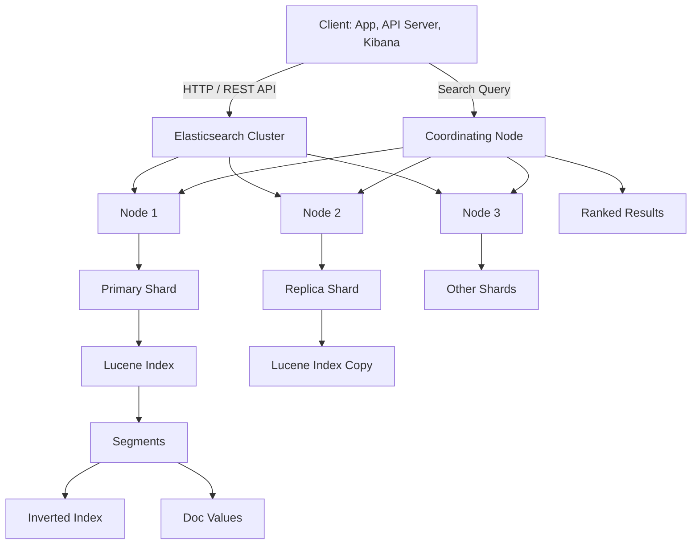
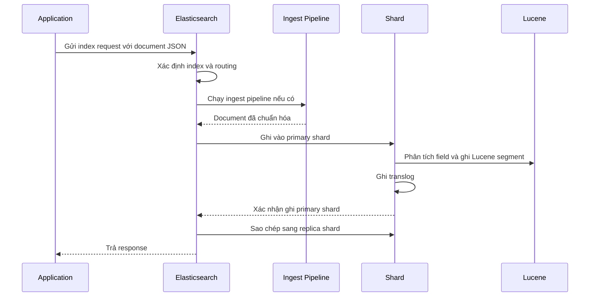
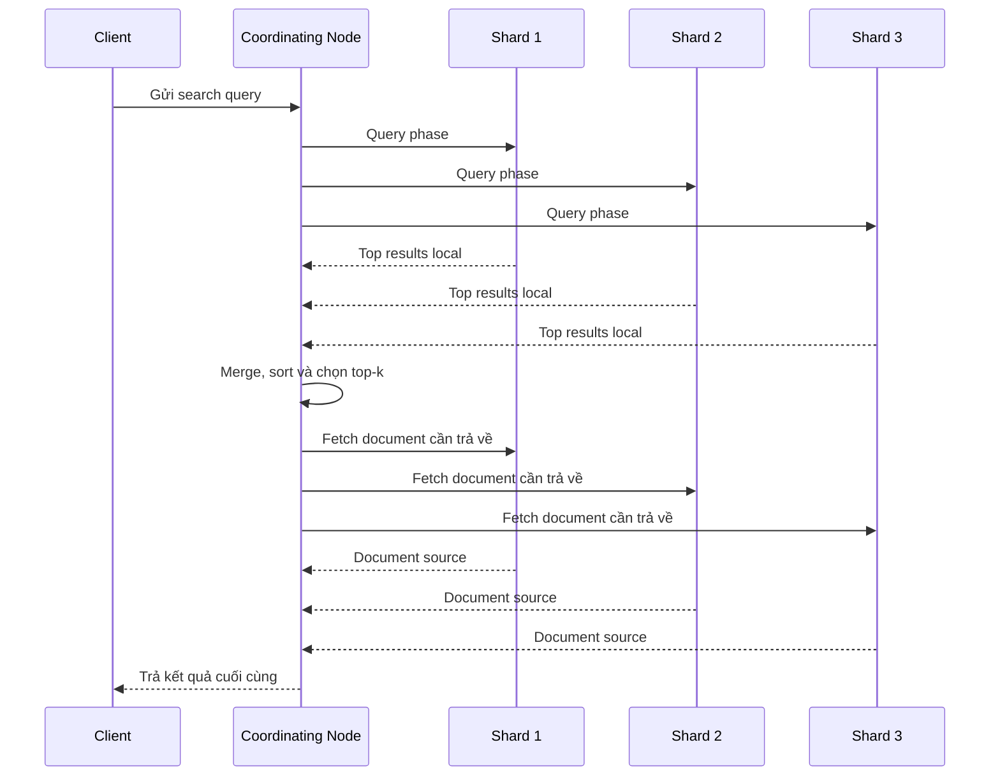
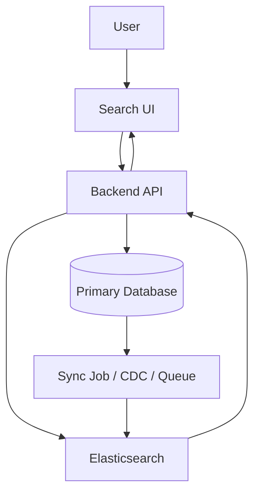
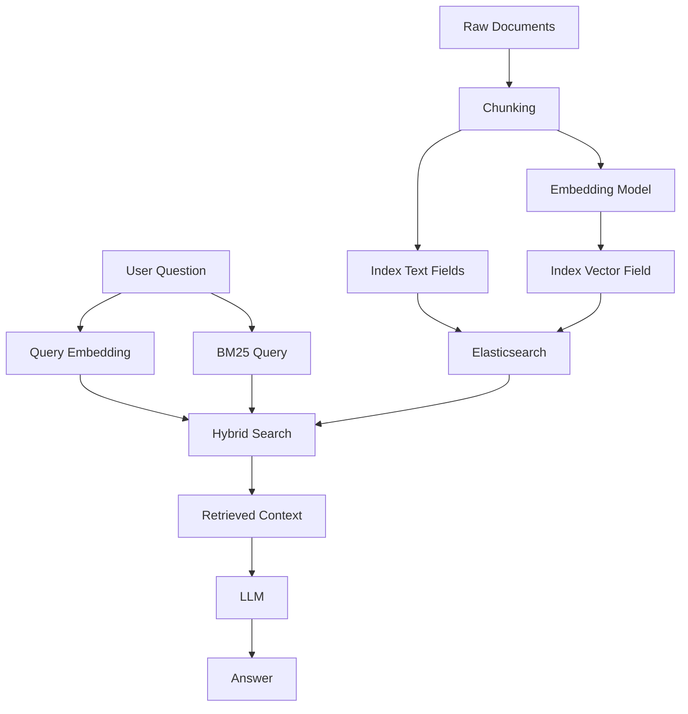

# Elasticsearch: Cơ sở lý thuyết, kiến trúc và thực hành

## 1. Mục tiêu tài liệu

Tài liệu này trình bày Elasticsearch theo hướng lý thuyết kết hợp thực hành, giúp người học nắm được:

- Elasticsearch là gì và vì sao nó được dùng nhiều trong hệ thống tìm kiếm, phân tích log và dữ liệu văn bản.
- Các khái niệm cốt lõi như cluster, node, index, document, field, mapping, shard, replica, analyzer và query DSL.
- Cách Elasticsearch lưu trữ document JSON và xây dựng inverted index để tìm kiếm toàn văn.
- Cách hoạt động của analysis pipeline, scoring, relevance, filter, aggregation và near real-time search.
- Cách thiết kế mapping, index, shard và alias cho bài toán thực tế.
- Cách dùng Elasticsearch trong search engine, observability, logging, analytics và một số luồng RAG/hybrid search.
- Các lỗi thiết kế thường gặp và cách tránh khi học hoặc triển khai Elasticsearch.

Tên chính thức của công nghệ này là **Elasticsearch**, không viết tách thành `ElasticSearch`. Tài liệu này tập trung vào nền tảng ổn định về mặt khái niệm. Một số API, cấu hình bảo mật và tính năng nâng cao có thể thay đổi theo phiên bản, vì vậy khi làm dự án thực tế nên đối chiếu thêm với tài liệu chính thức của Elastic đúng với phiên bản đang dùng.

## 2. Tổng quan về Elasticsearch

Elasticsearch là một search engine và analytics engine phân tán thuộc hệ sinh thái Elastic Stack. Elasticsearch được xây dựng dựa trên Apache Lucene, chuyên dùng để lưu trữ, đánh chỉ mục và truy vấn dữ liệu dạng document JSON.

Khác với cơ sở dữ liệu quan hệ tập trung vào bảng, khóa chính, khóa ngoại và transaction mạnh, Elasticsearch tập trung vào:

- Tìm kiếm toàn văn trên dữ liệu văn bản lớn.
- Truy vấn gần đúng theo relevance thay vì chỉ so khớp chính xác.
- Phân tích log, metric, event và dữ liệu thời gian thực gần đúng.
- Aggregation để thống kê, phân nhóm và khám phá dữ liệu.
- Mở rộng ngang bằng cluster nhiều node.

Elasticsearch thường được dùng cho:

- Search box trong website thương mại điện tử, thư viện số, hệ thống tài liệu hoặc ứng dụng nội bộ.
- Tìm kiếm sản phẩm theo tên, mô tả, danh mục, tag và thuộc tính.
- Logging và observability khi kết hợp với Kibana, Logstash, Beats hoặc Elastic Agent.
- Phân tích sự kiện bảo mật, audit log và truy vết hệ thống.
- Dashboard phân tích dữ liệu dạng event.
- Hybrid search kết hợp lexical search, vector search và metadata filtering.
- Retrieval-Augmented Generation khi cần truy xuất tài liệu theo từ khóa, ngữ nghĩa hoặc kết hợp cả hai.

### 2.1. Đặc điểm nổi bật

| Đặc điểm | Ý nghĩa |
| --- | --- |
| Full-text search | Tìm kiếm văn bản theo token, analyzer, relevance và ranking. |
| Inverted index | Cấu trúc dữ liệu giúp tìm document chứa từ khóa rất nhanh. |
| Distributed cluster | Chia dữ liệu thành shard và phân tán trên nhiều node. |
| Near real-time | Document mới index thường có thể tìm kiếm sau một khoảng refresh ngắn. |
| Query DSL | Truy vấn bằng JSON, hỗ trợ `match`, `term`, `range`, `bool`, `filter`, `aggregation` và nhiều kiểu query khác. |
| Mapping linh hoạt | Khai báo kiểu dữ liệu cho field như `text`, `keyword`, `date`, `integer`, `object`, `nested`, `dense_vector`. |
| Aggregation mạnh | Thống kê, phân nhóm, histogram, percentiles và phân tích dữ liệu ngay trong Elasticsearch. |
| Elastic Stack | Tích hợp tốt với Kibana, Logstash, Beats và Elastic Agent cho logging, monitoring và analytics. |

## 3. Cơ sở lý thuyết

### 3.1. Search engine

Search engine là hệ thống được thiết kế để nhận dữ liệu, đánh chỉ mục và trả về kết quả phù hợp nhất với truy vấn của người dùng. Với dữ liệu văn bản, search engine không chỉ kiểm tra điều kiện kiểu:

```text
name = "laptop"
```

mà còn xử lý các tình huống gần hơn với hành vi tìm kiếm thực tế:

- Người dùng nhập sai, thiếu hoặc thừa từ.
- Một câu truy vấn có nhiều từ nhưng không cần khớp toàn bộ.
- Kết quả cần được xếp hạng theo mức độ liên quan.
- Một field quan trọng hơn field khác, ví dụ tên sản phẩm quan trọng hơn mô tả.
- Cần lọc thêm theo danh mục, giá, trạng thái, ngày tạo hoặc quyền truy cập.

Ví dụ người dùng tìm:

```text
"điện thoại pin trâu chụp ảnh đẹp"
```

Hệ thống có thể trả về sản phẩm có mô tả:

```text
"smartphone camera sắc nét, dung lượng pin lớn, phù hợp đi du lịch"
```

dù hai câu không trùng hoàn toàn từng từ.

### 3.2. Document database

Elasticsearch lưu dữ liệu dưới dạng document JSON. Mỗi document là một đối tượng có các field, ví dụ:

```json
{
  "id": "p001",
  "name": "Laptop sinh viên 14 inch",
  "category": "laptop",
  "price": 12990000,
  "description": "Laptop mỏng nhẹ, pin tốt, phù hợp học tập và làm việc văn phòng",
  "created_at": "2026-06-03"
}
```

Document trong Elasticsearch gần với một bản ghi trong document database hơn là một dòng trong bảng quan hệ. Tuy nhiên, Elasticsearch không nên được hiểu đơn giản là database thay thế PostgreSQL hoặc MySQL. Nó mạnh ở tìm kiếm và phân tích, nhưng không tập trung vào transaction phức tạp, join quan hệ và ràng buộc dữ liệu như hệ quản trị cơ sở dữ liệu quan hệ.

Trong kiến trúc phổ biến, dữ liệu gốc vẫn nằm ở database chính như PostgreSQL, MySQL hoặc MongoDB. Elasticsearch giữ một bản index tối ưu cho tìm kiếm.

### 3.3. Inverted index

Inverted index là cấu trúc dữ liệu cốt lõi giúp Elasticsearch tìm kiếm văn bản nhanh.

Nếu có ba document:

| Document | Nội dung |
| --- | --- |
| `1` | `laptop sinh viên pin tốt` |
| `2` | `laptop gaming cấu hình mạnh` |
| `3` | `điện thoại pin tốt camera đẹp` |

Search engine có thể tạo inverted index đơn giản như sau:

| Term | Document chứa term |
| --- | --- |
| `laptop` | `1`, `2` |
| `sinh` | `1` |
| `viên` | `1` |
| `pin` | `1`, `3` |
| `tốt` | `1`, `3` |
| `gaming` | `2` |
| `điện` | `3` |
| `thoại` | `3` |
| `camera` | `3` |
| `đẹp` | `3` |

Khi người dùng tìm `laptop pin tốt`, Elasticsearch không cần đọc toàn bộ document. Nó tra inverted index để biết term nào xuất hiện trong document nào, sau đó tính điểm liên quan và trả về kết quả.

### 3.4. Analysis

Analysis là quá trình biến text gốc thành các token có thể tìm kiếm. Analysis thường gồm ba bước:

| Bước | Vai trò |
| --- | --- |
| Character filter | Xử lý text thô trước khi tách từ, ví dụ loại bỏ HTML hoặc thay ký tự đặc biệt. |
| Tokenizer | Tách chuỗi thành token, ví dụ tách câu thành các từ. |
| Token filter | Biến đổi token, ví dụ lowercase, bỏ stop word, stemming, synonym hoặc chuẩn hóa dấu. |

Ví dụ text:

```text
"Laptop Sinh Viên, Pin Tốt!"
```

có thể được analyzer xử lý thành:

```text
["laptop", "sinh", "viên", "pin", "tốt"]
```

Analyzer rất quan trọng vì cùng một dữ liệu có thể cho kết quả tìm kiếm rất khác nhau nếu cách tách từ khác nhau. Với tiếng Việt, cần cân nhắc kỹ vì tiếng Việt có khoảng trắng giữa các âm tiết, không phải lúc nào một âm tiết cũng là một từ hoàn chỉnh. Tùy bài toán, có thể dùng analyzer mặc định, plugin phân tích tiếng Việt, n-gram, synonym hoặc kết hợp nhiều field.

### 3.5. Mapping

Mapping là phần khai báo schema cho index. Mapping cho Elasticsearch biết mỗi field có kiểu dữ liệu gì và nên được index như thế nào.

Ví dụ mapping đơn giản:

```json
{
  "mappings": {
    "properties": {
      "name": {
        "type": "text",
        "fields": {
          "keyword": {
            "type": "keyword"
          }
        }
      },
      "category": {
        "type": "keyword"
      },
      "price": {
        "type": "integer"
      },
      "description": {
        "type": "text"
      },
      "created_at": {
        "type": "date"
      }
    }
  }
}
```

Một số kiểu field phổ biến:

| Kiểu field | Ý nghĩa | Khi dùng |
| --- | --- | --- |
| `text` | Field được phân tích thành token | Tìm kiếm toàn văn như tên, mô tả, nội dung bài viết |
| `keyword` | Field không phân tích, dùng giá trị nguyên vẹn | ID, category, tag, status, email, mã sản phẩm |
| `integer`, `long`, `float`, `double` | Số | Giá, số lượng, điểm, thống kê |
| `date` | Ngày giờ | `created_at`, `updated_at`, timestamp log |
| `boolean` | Đúng/sai | Trạng thái bật/tắt |
| `object` | Object JSON lồng nhau | Metadata đơn giản |
| `nested` | Mảng object cần query độc lập từng phần tử | Danh sách thuộc tính, biến thể sản phẩm, comment |
| `geo_point` | Tọa độ địa lý | Tìm kiếm theo vị trí |
| `dense_vector` | Vector số thực | Vector search hoặc hybrid search |

Mapping nên được thiết kế rõ ràng từ đầu. Dựa hoàn toàn vào dynamic mapping có thể tiện khi thử nghiệm, nhưng dễ gây sai kiểu dữ liệu, mapping explosion hoặc khó tối ưu truy vấn.

### 3.6. Relevance scoring

Relevance scoring là quá trình tính điểm để xếp hạng kết quả. Elasticsearch thường dùng thuật toán BM25 cho full-text search.

Ý tưởng trực quan:

- Document chứa nhiều term trong query thường liên quan hơn.
- Term hiếm trong toàn bộ index thường có giá trị phân biệt cao hơn term quá phổ biến.
- Field ngắn nhưng khớp tốt có thể được đánh giá cao hơn field rất dài.
- Có thể tăng trọng số cho field quan trọng, ví dụ `name^3` nghĩa là field `name` quan trọng hơn `description`.

Ví dụ query:

```json
{
  "query": {
    "multi_match": {
      "query": "laptop sinh viên pin tốt",
      "fields": ["name^3", "description"]
    }
  }
}
```

Trong ví dụ này, document khớp ở `name` sẽ được ưu tiên hơn document chỉ khớp ở `description`.

### 3.7. Query context và filter context

Elasticsearch phân biệt hai ngữ cảnh truy vấn quan trọng:

| Ngữ cảnh | Mục đích | Có tính score không |
| --- | --- | --- |
| Query context | Tìm document liên quan nhất | Có |
| Filter context | Lọc document theo điều kiện chính xác | Không |

Ví dụ:

- Tìm `laptop pin tốt` là query context vì cần tính độ liên quan.
- Lọc `category = laptop`, `price <= 15000000`, `is_active = true` là filter context vì chỉ cần đúng/sai.

Kết hợp đúng query và filter giúp hệ thống vừa có ranking tốt, vừa tối ưu hiệu năng:

```json
{
  "query": {
    "bool": {
      "must": [
        {
          "multi_match": {
            "query": "laptop pin tốt",
            "fields": ["name^3", "description"]
          }
        }
      ],
      "filter": [
        { "term": { "category": "laptop" } },
        { "range": { "price": { "lte": 15000000 } } }
      ]
    }
  }
}
```

### 3.8. Near real-time search

Elasticsearch là hệ thống near real-time. Sau khi index document, document đó không nhất thiết xuất hiện ngay lập tức trong kết quả tìm kiếm tại cùng một thời điểm tuyệt đối. Thường cần một chu kỳ refresh ngắn để segment mới có thể search được.

Cần phân biệt:

| Khái niệm | Ý nghĩa |
| --- | --- |
| Index request | Ghi document vào Elasticsearch. |
| Refresh | Làm dữ liệu mới có thể được tìm kiếm. |
| Flush | Ghi trạng thái bền vững hơn xuống storage và xử lý translog. |
| Merge | Gộp các segment nhỏ thành segment lớn hơn để tối ưu tìm kiếm. |

Trong ứng dụng thực tế, nếu vừa ghi xong mà cần đọc lại ngay bằng search, cần hiểu rõ refresh. Không nên lạm dụng refresh thủ công cho mọi request vì có thể làm giảm hiệu năng indexing.

## 4. Kiến trúc Elasticsearch

### 4.1. Sơ đồ kiến trúc Mermaid



Kiến trúc trên cho thấy Elasticsearch là một hệ thống phân tán. Người dùng gửi request đến cluster. Cluster phân phối dữ liệu vào các shard. Mỗi shard thực chất là một Lucene index. Khi tìm kiếm, coordinating node gửi query đến các shard liên quan, gom kết quả, sắp xếp và trả về client.

### 4.2. Các thành phần quan trọng

| Thành phần | Vai trò |
| --- | --- |
| Cluster | Tập hợp nhiều node Elasticsearch cùng phục vụ một hệ thống. |
| Node | Một tiến trình Elasticsearch tham gia cluster. |
| Index | Không gian logic chứa các document cùng loại hoặc cùng mục đích truy vấn. |
| Document | Đơn vị dữ liệu JSON được lưu và tìm kiếm. |
| Field | Thuộc tính bên trong document. |
| Mapping | Schema quy định kiểu dữ liệu và cách index từng field. |
| Shard | Phần chia nhỏ của index để phân tán dữ liệu và tải truy vấn. |
| Primary shard | Shard chính nhận ghi dữ liệu. |
| Replica shard | Bản sao của primary shard để tăng khả năng chịu lỗi và phục vụ đọc. |
| Segment | File Lucene bất biến chứa dữ liệu đã index. |
| Translog | Log ghi thay đổi để hỗ trợ phục hồi khi node gặp lỗi. |
| Alias | Tên thay thế trỏ đến một hoặc nhiều index. |

### 4.3. Cluster và node

Một cluster có thể có một hoặc nhiều node. Trong môi trường học tập, một node là đủ. Trong production, nhiều node giúp:

- Tăng dung lượng lưu trữ.
- Tăng khả năng phục vụ query.
- Tăng khả năng chịu lỗi.
- Tách vai trò node theo workload.

Một số vai trò node thường gặp:

| Vai trò | Ý nghĩa |
| --- | --- |
| Master-eligible node | Có thể tham gia bầu chọn và quản lý cluster state. |
| Data node | Lưu shard và xử lý indexing/search trên dữ liệu. |
| Ingest node | Chạy ingest pipeline trước khi index document. |
| Coordinating node | Nhận request, phân phối đến shard và gom kết quả. |
| Machine learning node | Chạy workload machine learning nếu tính năng được dùng. |

Trong cluster nhỏ, một node có thể giữ nhiều vai trò. Trong cluster lớn, nên tách vai trò để dễ mở rộng và vận hành.

### 4.4. Shard và replica

Khi tạo index, Elasticsearch chia index thành các primary shard. Mỗi primary shard có thể có một hoặc nhiều replica.

Ví dụ index `products` có 3 primary shard và 1 replica:

```text
products
├── primary shard 0
├── primary shard 1
├── primary shard 2
├── replica shard 0
├── replica shard 1
└── replica shard 2
```

Ý nghĩa:

- Primary shard giúp chia dữ liệu để mở rộng ngang.
- Replica shard giúp chịu lỗi khi node chứa primary shard gặp sự cố.
- Replica cũng có thể phục vụ search, giúp tăng throughput đọc.

Không nên chọn số shard theo cảm tính. Quá ít shard có thể khó mở rộng, nhưng quá nhiều shard làm tăng overhead quản lý, memory và cluster state.

### 4.5. Lucene, segment và merge

Elasticsearch dùng Apache Lucene làm thư viện search bên dưới. Mỗi shard là một Lucene index. Lucene lưu dữ liệu trong các segment bất biến.

Quy trình đơn giản:

1. Document được gửi vào Elasticsearch.
2. Elasticsearch phân tích field text thành token.
3. Token được ghi vào inverted index trong segment.
4. Segment mới được refresh để có thể search.
5. Nhiều segment nhỏ được merge thành segment lớn hơn theo thời gian.

Vì segment bất biến, update document trong Elasticsearch thường được xử lý như xóa phiên bản cũ và ghi phiên bản mới. Đây là lý do Elasticsearch không phù hợp với dữ liệu cần update từng field với tần suất quá cao như một OLTP database.

## 5. Vòng đời xử lý dữ liệu và truy vấn

### 5.1. Luồng ingest dữ liệu



Luồng ingest có thể đơn giản hoặc phức tạp tùy hệ thống. Với logging, dữ liệu có thể đi từ application sang Filebeat hoặc Elastic Agent, qua Logstash hoặc ingest pipeline, rồi vào Elasticsearch. Với search sản phẩm, dữ liệu thường được đồng bộ từ database chính sang Elasticsearch qua job nền, message queue hoặc CDC.

### 5.2. Luồng tìm kiếm



Search thường gồm hai pha:

1. **Query phase**: mỗi shard tìm top kết quả cục bộ và trả về ID, score.
2. **Fetch phase**: coordinating node lấy nội dung document cần trả về.

Cách này giúp Elasticsearch tìm kiếm phân tán hiệu quả trên nhiều shard.

### 5.3. Luồng update và delete

Update trong Elasticsearch không giống update một dòng trong database quan hệ. Vì Lucene segment bất biến, update thường là:

1. Tìm document theo `_id`.
2. Đánh dấu phiên bản cũ là đã xóa.
3. Ghi document mới với nội dung đã cập nhật.
4. Chờ merge dọn dữ liệu cũ theo thời gian.

Delete cũng thường là đánh dấu xóa trước, sau đó segment merge sẽ dọn vật lý. Vì vậy workload update/delete quá dày có thể tạo áp lực lên merge, disk I/O và heap.

## 6. Các khái niệm cốt lõi

### 6.1. Index

Index là nơi lưu các document có cùng mục đích truy vấn. Ví dụ:

- `products` lưu sản phẩm.
- `articles` lưu bài viết.
- `logs-2026.06.03` lưu log theo ngày.
- `orders-search` lưu bản index phục vụ tìm kiếm đơn hàng.

Trong Elasticsearch, index không giống hoàn toàn với database trong RDBMS. Index gần hơn với một collection/search space. Một index có mapping, setting, shard và replica riêng.

### 6.2. Document

Document là đơn vị dữ liệu JSON được index và search. Mỗi document có:

- `_index`: index chứa document.
- `_id`: định danh document.
- `_source`: JSON gốc được lưu lại.
- Field người dùng định nghĩa như `name`, `price`, `category`.

Ví dụ document sản phẩm:

```json
{
  "name": "Tai nghe bluetooth chống ồn",
  "category": "audio",
  "price": 890000,
  "tags": ["wireless", "noise-cancelling"],
  "is_active": true
}
```

### 6.3. Field

Field là thuộc tính bên trong document. Một field có thể được index theo nhiều cách. Ví dụ field `name` có thể vừa là `text` để tìm kiếm toàn văn, vừa có subfield `name.keyword` để sort hoặc aggregation theo giá trị nguyên vẹn.

```json
{
  "name": {
    "type": "text",
    "fields": {
      "keyword": {
        "type": "keyword"
      }
    }
  }
}
```

Cách này rất phổ biến vì cùng một dữ liệu có hai nhu cầu:

- Search theo từ trong tên sản phẩm.
- Sort, filter hoặc aggregation theo tên chính xác.

### 6.4. Text và keyword

`text` và `keyword` là hai kiểu dễ nhầm nhất khi mới học Elasticsearch.

| Kiểu | Cách index | Phù hợp với |
| --- | --- | --- |
| `text` | Được analyzer tách thành token | Full-text search |
| `keyword` | Giữ nguyên toàn bộ giá trị | Filter, sort, aggregation, exact match |

Ví dụ:

```json
{
  "status": "PUBLISHED",
  "title": "Hướng dẫn học Elasticsearch cơ bản"
}
```

Nên thiết kế:

- `status` là `keyword`.
- `title` là `text`, có thể thêm `title.keyword` nếu cần sort hoặc exact match.

### 6.5. Analyzer

Analyzer quyết định cách text được index và query. Analyzer khác nhau có thể tạo token khác nhau.

Một analyzer thường có:

- Character filter.
- Tokenizer.
- Token filter.

Ví dụ analyzer đơn giản:

```json
{
  "settings": {
    "analysis": {
      "analyzer": {
        "lowercase_analyzer": {
          "type": "custom",
          "tokenizer": "standard",
          "filter": ["lowercase"]
        }
      }
    }
  }
}
```

Với tiếng Việt, cần kiểm tra chất lượng token hóa trên dữ liệu thật. Nếu token hóa không tốt, kết quả search có thể thiếu chính xác dù query DSL viết đúng.

### 6.6. Query DSL

Query DSL là ngôn ngữ truy vấn JSON của Elasticsearch. Một số query phổ biến:

| Query | Ý nghĩa |
| --- | --- |
| `match` | Full-text search trên một field. |
| `multi_match` | Full-text search trên nhiều field. |
| `term` | Exact match trên field không phân tích, thường là `keyword`. |
| `terms` | Exact match với nhiều giá trị. |
| `range` | Lọc theo khoảng số hoặc ngày. |
| `exists` | Kiểm tra field có tồn tại. |
| `bool` | Kết hợp nhiều điều kiện `must`, `should`, `filter`, `must_not`. |
| `nested` | Query dữ liệu kiểu `nested`. |
| `knn` | Tìm kiếm vector gần nhất khi dùng vector field. |

Ví dụ `bool query`:

```json
{
  "query": {
    "bool": {
      "must": [
        { "match": { "description": "pin tốt" } }
      ],
      "filter": [
        { "term": { "category": "laptop" } },
        { "range": { "price": { "lte": 15000000 } } }
      ],
      "must_not": [
        { "term": { "is_active": false } }
      ]
    }
  }
}
```

### 6.7. Aggregation

Aggregation dùng để thống kê và phân tích dữ liệu. Ví dụ:

- Đếm số sản phẩm theo danh mục.
- Tính giá trung bình.
- Vẽ histogram theo ngày.
- Tính percentile của thời gian phản hồi API.
- Tìm top user có nhiều request nhất.

Ví dụ aggregation theo danh mục:

```json
{
  "size": 0,
  "aggs": {
    "products_by_category": {
      "terms": {
        "field": "category"
      }
    }
  }
}
```

Trong ví dụ này, `size: 0` nghĩa là không cần trả document, chỉ cần kết quả aggregation.

### 6.8. Alias

Alias là tên thay thế trỏ đến một hoặc nhiều index. Alias rất hữu ích khi cần reindex không gián đoạn.

Ví dụ:

```text
products_current -> products_v1
```

Khi cần thay mapping, có thể tạo index mới:

```text
products_v2
```

sau đó reindex dữ liệu và chuyển alias:

```text
products_current -> products_v2
```

Ứng dụng chỉ cần truy vấn `products_current`, không cần biết index vật lý phía sau là phiên bản nào.

### 6.9. Data stream

Data stream phù hợp với dữ liệu append-only theo thời gian như log, metric, trace hoặc event. Thay vì ghi vào một index duy nhất ngày càng lớn, data stream quản lý nhiều backing index phía sau và có thể kết hợp với lifecycle policy.

Ví dụ:

- `logs-app-default`
- `metrics-system-default`
- `traces-apm-default`

Data stream giúp vận hành dữ liệu time-series dễ hơn, đặc biệt khi cần rollover, retention và xóa dữ liệu cũ.

### 6.10. Ingest pipeline

Ingest pipeline xử lý document trước khi index. Một pipeline có thể:

- Đổi tên field.
- Thêm field mới.
- Parse ngày.
- Tách thông tin từ chuỗi log.
- Xóa field nhạy cảm.
- Chuẩn hóa dữ liệu.
- Gọi processor như `set`, `rename`, `date`, `grok`, `remove`, `script`.

Ví dụ pipeline đơn giản:

```json
{
  "processors": [
    {
      "set": {
        "field": "ingested_by",
        "value": "elasticsearch"
      }
    }
  ]
}
```

Ingest pipeline phù hợp cho xử lý nhẹ. Nếu cần transform phức tạp, validate nghiệp vụ hoặc join nhiều nguồn dữ liệu, nên xử lý ở application, ETL job hoặc Logstash.

## 7. Ví dụ sử dụng Elasticsearch cơ bản

### 7.1. Chạy Elasticsearch bằng Docker

Ví dụ chạy một node để học tập:

```bash
docker run --name elasticsearch-demo \
  -p 9200:9200 \
  -e discovery.type=single-node \
  -e xpack.security.enabled=false \
  -e ES_JAVA_OPTS="-Xms1g -Xmx1g" \
  docker.elastic.co/elasticsearch/elasticsearch:<version>
```

Trong đó:

- `discovery.type=single-node` dùng cho môi trường học tập một node.
- `xpack.security.enabled=false` giúp thử nghiệm local đơn giản hơn, không nên dùng như vậy trong production.
- `ES_JAVA_OPTS` giới hạn heap để tránh Elasticsearch dùng quá nhiều RAM trên máy cá nhân.
- `<version>` nên thay bằng phiên bản Elasticsearch đang học hoặc đang dùng trong dự án.

Kiểm tra server:

```bash
curl http://localhost:9200
```

### 7.2. Tạo index với mapping

```bash
curl -X PUT "http://localhost:9200/products" \
  -H "Content-Type: application/json" \
  -d '{
    "mappings": {
      "properties": {
        "name": {
          "type": "text",
          "fields": {
            "keyword": {
              "type": "keyword"
            }
          }
        },
        "category": {
          "type": "keyword"
        },
        "price": {
          "type": "integer"
        },
        "description": {
          "type": "text"
        },
        "created_at": {
          "type": "date"
        }
      }
    }
  }'
```

### 7.3. Thêm document

```bash
curl -X POST "http://localhost:9200/products/_doc/1" \
  -H "Content-Type: application/json" \
  -d '{
    "name": "Laptop sinh viên 14 inch",
    "category": "laptop",
    "price": 12990000,
    "description": "Laptop mỏng nhẹ, pin tốt, phù hợp học tập và làm việc văn phòng",
    "created_at": "2026-06-03"
  }'
```

Thêm document thứ hai:

```bash
curl -X POST "http://localhost:9200/products/_doc/2" \
  -H "Content-Type: application/json" \
  -d '{
    "name": "Laptop gaming cấu hình mạnh",
    "category": "laptop",
    "price": 24990000,
    "description": "Máy tính xách tay hiệu năng cao, card đồ họa rời, màn hình tần số quét cao",
    "created_at": "2026-06-03"
  }'
```

### 7.4. Tìm kiếm toàn văn

```bash
curl -X GET "http://localhost:9200/products/_search" \
  -H "Content-Type: application/json" \
  -d '{
    "query": {
      "match": {
        "description": "pin tốt học tập"
      }
    }
  }'
```

### 7.5. Tìm kiếm nhiều field kèm filter

```bash
curl -X GET "http://localhost:9200/products/_search" \
  -H "Content-Type: application/json" \
  -d '{
    "query": {
      "bool": {
        "must": [
          {
            "multi_match": {
              "query": "laptop sinh viên",
              "fields": ["name^3", "description"]
            }
          }
        ],
        "filter": [
          {
            "term": {
              "category": "laptop"
            }
          },
          {
            "range": {
              "price": {
                "lte": 15000000
              }
            }
          }
        ]
      }
    }
  }'
```

### 7.6. Aggregation theo category

```bash
curl -X GET "http://localhost:9200/products/_search" \
  -H "Content-Type: application/json" \
  -d '{
    "size": 0,
    "aggs": {
      "by_category": {
        "terms": {
          "field": "category"
        }
      }
    }
  }'
```

### 7.7. Sử dụng bằng Python

Cài thư viện:

```bash
pip install elasticsearch
```

Ví dụ index và search:

```python
from elasticsearch import Elasticsearch


es = Elasticsearch("http://localhost:9200")

index_name = "products"

if not es.indices.exists(index=index_name):
    es.indices.create(
        index=index_name,
        mappings={
            "properties": {
                "name": {
                    "type": "text",
                    "fields": {"keyword": {"type": "keyword"}},
                },
                "category": {"type": "keyword"},
                "price": {"type": "integer"},
                "description": {"type": "text"},
                "created_at": {"type": "date"},
            }
        },
    )

es.index(
    index=index_name,
    id="1",
    document={
        "name": "Laptop sinh viên 14 inch",
        "category": "laptop",
        "price": 12990000,
        "description": "Laptop mỏng nhẹ, pin tốt, phù hợp học tập",
        "created_at": "2026-06-03",
    },
)

result = es.search(
    index=index_name,
    query={
        "bool": {
            "must": [
                {
                    "multi_match": {
                        "query": "laptop pin tốt",
                        "fields": ["name^3", "description"],
                    }
                }
            ],
            "filter": [
                {"term": {"category": "laptop"}},
                {"range": {"price": {"lte": 15000000}}},
            ],
        }
    },
)

for hit in result["hits"]["hits"]:
    print(hit["_score"], hit["_source"]["name"])
```

## 8. Elasticsearch trong hệ thống tìm kiếm

### 8.1. Sơ đồ search service



Trong kiến trúc này:

1. Database chính lưu dữ liệu nguồn đáng tin cậy.
2. Job đồng bộ đưa dữ liệu cần tìm kiếm sang Elasticsearch.
3. Người dùng gửi query qua UI.
4. Backend API gọi Elasticsearch để lấy danh sách ID hoặc document phù hợp.
5. Nếu cần dữ liệu nghiệp vụ mới nhất, API có thể đọc bổ sung từ database chính.

Elasticsearch thường đóng vai trò search index, không nhất thiết là source of truth.

### 8.2. Thiết kế search sản phẩm

Với bài toán sản phẩm, cần cân nhắc các field:

| Field | Kiểu gợi ý | Mục đích |
| --- | --- | --- |
| `product_id` | `keyword` | Exact match, join ngược về database chính |
| `name` | `text` + `keyword` | Tìm kiếm theo tên, sort nếu cần |
| `description` | `text` | Full-text search |
| `category_id` | `keyword` | Filter theo danh mục |
| `brand` | `keyword` hoặc `text` + `keyword` | Filter hoặc search theo thương hiệu |
| `price` | `integer` hoặc `scaled_float` | Range filter, sort |
| `tags` | `keyword` | Filter và boost |
| `is_active` | `boolean` | Chỉ hiển thị sản phẩm đang bán |
| `created_at` | `date` | Sort, filter theo thời gian |

Một query search sản phẩm thường gồm:

- `multi_match` trên `name`, `description`, `brand`.
- `filter` theo category, giá, trạng thái.
- `sort` theo relevance, giá hoặc ngày tạo.
- `highlight` để hiển thị đoạn text khớp.
- `aggregation` để hiển thị bộ lọc faceted search.

### 8.3. Faceted search

Faceted search là kiểu tìm kiếm có bộ lọc động, thường gặp ở thương mại điện tử.

Ví dụ người dùng tìm `laptop`, hệ thống trả về:

- Danh sách sản phẩm phù hợp.
- Số lượng sản phẩm theo thương hiệu.
- Khoảng giá.
- Dung lượng RAM.
- Kích thước màn hình.
- Trạng thái còn hàng.

Elasticsearch hỗ trợ faceted search tốt nhờ aggregation. Tuy nhiên, cần dùng field kiểu `keyword`, số hoặc date phù hợp. Không nên aggregation trực tiếp trên field `text` đã phân tích.

## 9. Elasticsearch trong logging và observability

Elasticsearch rất phổ biến trong logging và observability vì log thường là dữ liệu append-only, có timestamp, khối lượng lớn và cần tìm kiếm nhanh.

Một luồng logging phổ biến:


Các nhu cầu thường gặp:

- Tìm log theo `trace_id`, `request_id`, `user_id`.
- Lọc log theo service, environment, level.
- Thống kê lỗi theo thời gian.
- Theo dõi latency API.
- Phân tích bất thường trong traffic.

Với log, thiết kế field nên ưu tiên:

- `@timestamp` kiểu `date`.
- `service.name` kiểu `keyword`.
- `log.level` kiểu `keyword`.
- `message` kiểu `text`.
- `trace.id`, `transaction.id`, `user.id` kiểu `keyword`.
- Các metric số dùng kiểu numeric.

## 10. Elasticsearch trong RAG và hybrid search

Elasticsearch ban đầu nổi bật với lexical search dựa trên từ khóa và inverted index. Trong các hệ thống AI hiện đại, Elasticsearch cũng có thể được dùng cho RAG bằng hai hướng:

- **Lexical retrieval**: tìm tài liệu theo từ khóa bằng BM25.
- **Vector retrieval**: tìm tài liệu theo embedding vector.
- **Hybrid retrieval**: kết hợp BM25, vector search và filter metadata.

### 10.1. Sơ đồ RAG với Elasticsearch



### 10.2. Khi nào dùng Elasticsearch cho RAG

Elasticsearch phù hợp khi:

- Dữ liệu vừa cần tìm theo từ khóa, vừa cần tìm theo ngữ nghĩa.
- Cần filter theo metadata như quyền truy cập, phòng ban, loại tài liệu, ngày tạo.
- Hệ thống đã dùng Elastic Stack cho log/search.
- Cần aggregation hoặc dashboard trên cùng dữ liệu.
- Truy vấn có nhiều từ khóa chuyên ngành, mã lỗi, mã sản phẩm hoặc tên riêng.

Nếu bài toán chủ yếu là vector search quy mô lớn với yêu cầu ANN chuyên sâu, có thể cân nhắc vector database chuyên dụng như Qdrant hoặc Milvus. Nếu bài toán cần hybrid search và filter mạnh trên metadata, Elasticsearch là một lựa chọn đáng cân nhắc.

### 10.3. Thiết kế document cho RAG

Một document chunk trong Elasticsearch có thể có dạng:

```json
{
  "chunk_id": "doc-001-0003",
  "document_id": "doc-001",
  "title": "Quy định học vụ",
  "content": "Sinh viên cần hoàn thành số tín chỉ tối thiểu...",
  "content_vector": [0.12, -0.04, 0.88],
  "source": "student-handbook.pdf",
  "page": 12,
  "department": "academic",
  "access_roles": ["student", "advisor"],
  "updated_at": "2026-06-03"
}
```

Các field quan trọng:

- `content` để BM25 search.
- `content_vector` để vector search.
- `document_id`, `source`, `page` để trích dẫn nguồn.
- `access_roles` để filter phân quyền.
- `updated_at` để ưu tiên tài liệu mới hoặc lọc dữ liệu cũ.

## 11. So sánh Elasticsearch với cơ sở dữ liệu khác

### 11.1. Elasticsearch và PostgreSQL

| Tiêu chí | Elasticsearch | PostgreSQL |
| --- | --- | --- |
| Mô hình dữ liệu | Document JSON, index cho search | Bảng quan hệ |
| Ngôn ngữ truy vấn | Query DSL JSON | SQL |
| Điểm mạnh | Full-text search, relevance, aggregation, log analytics | Transaction, consistency, join, constraint |
| Transaction | Không phải trọng tâm chính | ACID mạnh |
| Join | Hạn chế, thường denormalize | Rất mạnh |
| Schema | Mapping linh hoạt | Schema chặt chẽ |
| Use case | Search, log, analytics | Source of truth, nghiệp vụ chính |

Trong nhiều hệ thống, PostgreSQL và Elasticsearch được dùng cùng nhau. PostgreSQL lưu dữ liệu gốc, Elasticsearch phục vụ tìm kiếm.

### 11.2. Elasticsearch và MongoDB

| Tiêu chí | Elasticsearch | MongoDB |
| --- | --- | --- |
| Mô hình dữ liệu | Document JSON tối ưu cho search index | Document database tổng quát |
| Tìm kiếm toàn văn | Rất mạnh | Có hỗ trợ, nhưng không phải trọng tâm giống Elasticsearch |
| Aggregation | Mạnh cho analytics/search | Mạnh cho xử lý document database |
| Transaction | Hạn chế hơn database chính | Hỗ trợ transaction tùy mô hình |
| Use case | Search, observability, analytics | Ứng dụng document database |

MongoDB phù hợp làm database chính cho nhiều ứng dụng document-oriented. Elasticsearch phù hợp hơn khi search relevance và inverted index là trung tâm.

### 11.3. Elasticsearch và vector database

| Tiêu chí | Elasticsearch | Qdrant/Milvus |
| --- | --- | --- |
| Lexical search | Rất mạnh | Không phải trọng tâm chính |
| Vector search | Có hỗ trợ | Là trọng tâm chính |
| Hybrid search | Phù hợp khi cần BM25 + vector + filter | Có hỗ trợ tùy hệ thống |
| Aggregation | Rất mạnh | Thường hạn chế hơn |
| Observability/logging | Rất phổ biến | Không phải use case chính |
| RAG | Tốt khi cần từ khóa, filter và metadata | Tốt khi vector retrieval là trung tâm |

Không có lựa chọn nào luôn tốt nhất. Cần chọn theo kiểu dữ liệu, pattern truy vấn, yêu cầu vận hành và hệ sinh thái đã có.

## 12. Thiết kế dữ liệu trong Elasticsearch

### 12.1. Denormalization

Elasticsearch không mạnh về join như database quan hệ. Vì vậy dữ liệu đưa vào Elasticsearch thường được denormalize.

Ví dụ thay vì lưu sản phẩm và danh mục ở hai nơi rồi join khi search:

```json
{
  "product_id": "p001",
  "name": "Laptop sinh viên 14 inch",
  "category": {
    "id": "laptop",
    "name": "Laptop"
  },
  "brand": {
    "id": "brand-a",
    "name": "Brand A"
  }
}
```

Document search nên chứa sẵn thông tin cần hiển thị và lọc. Khi category hoặc brand đổi tên, cần có cơ chế đồng bộ lại các document liên quan.

### 12.2. Chọn index

Một số cách chia index:

| Cách chia | Khi phù hợp |
| --- | --- |
| Theo domain | `products`, `articles`, `users-search` |
| Theo thời gian | `logs-2026.06.03`, `events-2026.06` |
| Theo tenant lớn | Mỗi khách hàng lớn có index riêng |
| Dùng data stream | Log, metric, event append-only |

Không nên tạo quá nhiều index nhỏ nếu không cần thiết vì mỗi index và shard đều có overhead. Với multi-tenant, cần cân nhắc giữa cô lập dữ liệu và chi phí vận hành.

### 12.3. Chọn mapping

Nguyên tắc cơ bản:

- Field dùng để full-text search nên là `text`.
- Field dùng để filter, sort, aggregation nên là `keyword`, numeric hoặc date.
- Field có cả hai nhu cầu nên dùng multi-field, ví dụ `name` và `name.keyword`.
- Không để dynamic mapping tự tạo quá nhiều field từ dữ liệu không kiểm soát.
- Với mảng object cần query đúng từng object con, dùng `nested`.
- Với tiền tệ, cân nhắc lưu số nguyên theo đơn vị nhỏ nhất hoặc dùng `scaled_float`.

Ví dụ không nên:

```json
{
  "price": "12990000"
}
```

nếu cần range filter hoặc sort theo giá. Nên dùng:

```json
{
  "price": 12990000
}
```

và mapping `price` là numeric.

### 12.4. Chọn shard

Khi chọn shard, cần cân nhắc:

- Dung lượng dữ liệu hiện tại và dự kiến tăng trưởng.
- Số node trong cluster.
- Query throughput.
- Indexing throughput.
- Retention policy.
- Khả năng rollover index.

Với dữ liệu time-series, thường dùng rollover theo dung lượng hoặc thời gian thay vì để một index tăng mãi. Với dữ liệu domain như sản phẩm hoặc bài viết, số shard có thể ít hơn và ổn định hơn.

### 12.5. Thiết kế đồng bộ dữ liệu

Nếu Elasticsearch là index phụ, cần có chiến lược đồng bộ từ database chính:

| Cách đồng bộ | Ý nghĩa |
| --- | --- |
| Batch job | Chạy định kỳ, phù hợp dữ liệu không cần real-time. |
| Message queue | Application ghi event vào queue khi dữ liệu thay đổi. |
| CDC | Đọc change log từ database để đồng bộ gần thời gian thực. |
| Reindex toàn bộ | Dùng khi đổi mapping hoặc xây lại index. |

Cần xử lý các tình huống:

- Ghi thành công database nhưng đồng bộ Elasticsearch thất bại.
- Document bị xóa ở database chính.
- Mapping mới yêu cầu reindex.
- Dữ liệu search bị trễ so với dữ liệu gốc.
- Event đến sai thứ tự.

## 13. Tối ưu truy vấn và vận hành

### 13.1. Tối ưu query

Một số nguyên tắc:

- Dùng `filter` cho điều kiện không cần score.
- Dùng `keyword` cho exact match.
- Tránh wildcard ở đầu chuỗi như `*phone` trên dữ liệu lớn.
- Tránh deep pagination bằng `from` quá lớn; cân nhắc `search_after`.
- Chỉ trả field cần thiết bằng `_source` filtering.
- Dùng `size` hợp lý, không lấy quá nhiều kết quả trong một request.
- Dùng `profile` và `explain` khi cần phân tích query.

Ví dụ chỉ lấy field cần thiết:

```json
{
  "_source": ["name", "price", "category"],
  "query": {
    "match": {
      "description": "pin tốt"
    }
  }
}
```

### 13.2. Tối ưu indexing

Một số nguyên tắc:

- Dùng Bulk API khi index nhiều document.
- Tạm tăng `refresh_interval` khi import dữ liệu lớn.
- Thiết kế mapping trước khi ingest dữ liệu.
- Tránh document quá lớn.
- Tránh update quá thường xuyên nếu không cần.
- Theo dõi merge, heap, disk I/O và indexing pressure.

Ví dụ bulk format:

```json
{ "index": { "_index": "products", "_id": "1" } }
{ "name": "Laptop sinh viên", "category": "laptop", "price": 12990000 }
{ "index": { "_index": "products", "_id": "2" } }
{ "name": "Tai nghe bluetooth", "category": "audio", "price": 890000 }
```

Bulk API dùng định dạng NDJSON, mỗi action và document nằm trên các dòng riêng.

### 13.3. Theo dõi sức khỏe cluster

Một số API hữu ích:

```bash
curl http://localhost:9200/_cluster/health
curl http://localhost:9200/_cat/nodes?v
curl http://localhost:9200/_cat/indices?v
curl http://localhost:9200/_cat/shards?v
```

Trạng thái cluster health:

| Trạng thái | Ý nghĩa |
| --- | --- |
| `green` | Primary và replica shard đều được phân bổ đầy đủ. |
| `yellow` | Primary shard hoạt động, nhưng một số replica chưa được phân bổ. |
| `red` | Một số primary shard không hoạt động, dữ liệu có thể không truy cập được. |

Trong môi trường single-node, trạng thái `yellow` có thể xuất hiện nếu index yêu cầu replica nhưng không có node khác để đặt replica.

### 13.4. Backup bằng snapshot

Elasticsearch dùng snapshot để backup index hoặc cluster state vào repository như filesystem, S3 hoặc storage tương thích. Không nên backup bằng cách copy trực tiếp thư mục data khi node đang chạy vì có thể không nhất quán.

Snapshot giúp:

- Phục hồi khi mất dữ liệu.
- Di chuyển dữ liệu giữa cluster.
- Lưu trữ dữ liệu cũ.
- Giảm rủi ro trước khi reindex hoặc thay đổi lớn.

## 14. Ưu điểm và hạn chế

### 14.1. Ưu điểm

- Tìm kiếm toàn văn mạnh, phù hợp dữ liệu văn bản lớn.
- Query DSL linh hoạt, hỗ trợ relevance, filter, sort và aggregation.
- Mở rộng ngang bằng shard và replica.
- Hệ sinh thái Elastic Stack phong phú, đặc biệt cho logging và observability.
- Hỗ trợ nhiều kiểu dữ liệu, bao gồm text, keyword, geo, nested và vector.
- Phù hợp cho search service, dashboard analytics và log analytics.
- Có thể kết hợp lexical search và vector search trong hệ thống RAG.

### 14.2. Hạn chế

- Không thay thế hoàn toàn database quan hệ cho nghiệp vụ cần transaction mạnh.
- Join hạn chế, thường phải denormalize dữ liệu.
- Mapping sai có thể khó sửa, thường cần reindex.
- Vận hành cluster lớn cần hiểu heap, shard, disk, merge và cluster state.
- Dữ liệu near real-time, không phải lúc nào vừa ghi xong cũng search thấy ngay.
- Update/delete tần suất cao có thể gây áp lực lên segment merge.
- Thiết kế analyzer cho tiếng Việt cần thử nghiệm kỹ trên dữ liệu thật.

## 15. Các lỗi thiết kế thường gặp

### 15.1. Dùng Elasticsearch làm source of truth duy nhất

Elasticsearch có thể lưu document, nhưng không nên mặc định dùng nó làm database chính cho nghiệp vụ cần transaction, ràng buộc và quan hệ phức tạp. Nên có database chính và xem Elasticsearch là search index nếu bài toán yêu cầu tính nhất quán nghiệp vụ cao.

### 15.2. Không khai báo mapping rõ ràng

Dynamic mapping tiện khi thử nhanh, nhưng dễ tạo field sai kiểu. Ví dụ `price` bị nhận thành `text` sẽ làm range query và sort khó xử lý. Với production, nên tạo index template hoặc mapping rõ ràng.

### 15.3. Nhầm `text` và `keyword`

Dùng `text` cho filter exact match hoặc aggregation có thể gây lỗi hoặc kết quả không như mong muốn. Dùng `keyword` cho nội dung cần full-text search cũng làm search kém linh hoạt. Cần phân biệt rõ nhu cầu của từng field.

### 15.4. Tạo quá nhiều shard

Shard không miễn phí. Quá nhiều shard nhỏ làm tăng overhead, tốn heap và làm cluster khó ổn định. Nên tính shard theo dung lượng, số node và workload thực tế.

### 15.5. Deep pagination bằng `from` quá lớn

Truy vấn kiểu lấy trang rất sâu:

```json
{
  "from": 100000,
  "size": 20
}
```

có thể rất tốn tài nguyên vì Elasticsearch vẫn phải xử lý nhiều kết quả trước đó. Với infinite scroll hoặc export lớn, nên cân nhắc `search_after`, point in time hoặc scroll tùy trường hợp.

### 15.6. Lạm dụng wildcard và regex

Wildcard query, đặc biệt wildcard ở đầu chuỗi, có thể rất nặng trên dữ liệu lớn. Nếu cần autocomplete hoặc search một phần từ, nên thiết kế analyzer, n-gram, edge n-gram hoặc search-as-you-type từ đầu.

### 15.7. Không xử lý phân quyền trong filter

Với search tài liệu nội bộ hoặc RAG, nếu không filter theo quyền truy cập, người dùng có thể thấy tài liệu không được phép xem. Metadata phân quyền như `tenant_id`, `owner_id`, `access_roles` nên được đưa vào document và luôn dùng trong filter.

### 15.8. Không có chiến lược reindex

Mapping của field đã có dữ liệu thường không thể đổi trực tiếp theo cách tùy ý. Khi cần đổi analyzer hoặc kiểu field, thường phải tạo index mới và reindex. Vì vậy nên dùng alias như `products_current` để chuyển index ít gián đoạn.

### 15.9. Bỏ qua chất lượng relevance

Search tốt không chỉ là query chạy được. Cần đánh giá:

- Kết quả đầu có đúng ý người dùng không.
- Field nào nên được boost.
- Synonym nào cần thêm.
- Có cần autocomplete, typo tolerance hoặc fuzzy search không.
- Filter có làm mất kết quả quan trọng không.

Nên tạo bộ query kiểm thử với expected results để đánh giá relevance sau mỗi lần đổi analyzer, mapping hoặc scoring.

## 16. Bài tập thực hành

### Bài 1: Tạo index sản phẩm

Tạo index `products` với các field:

- `product_id`: `keyword`
- `name`: `text` và subfield `keyword`
- `category`: `keyword`
- `brand`: `keyword`
- `price`: `integer`
- `description`: `text`
- `is_active`: `boolean`
- `created_at`: `date`

Sau đó thêm ít nhất 10 sản phẩm mẫu.

### Bài 2: Viết truy vấn tìm kiếm

Viết các query:

- Tìm sản phẩm theo từ khóa trong `name` và `description`.
- Lọc sản phẩm theo `category`.
- Lọc sản phẩm theo khoảng giá.
- Sắp xếp theo giá tăng dần.
- Boost field `name` cao hơn `description`.

### Bài 3: Aggregation

Viết aggregation để:

- Đếm số sản phẩm theo category.
- Tính giá trung bình theo category.
- Tìm giá nhỏ nhất và lớn nhất.
- Thống kê số sản phẩm được tạo theo từng ngày.

### Bài 4: Alias và reindex

Tạo index `products_v1`, gắn alias `products_current`. Sau đó tạo `products_v2` với mapping mới, reindex dữ liệu từ `products_v1` sang `products_v2` và chuyển alias sang index mới.

### Bài 5: Thiết kế search cho RAG

Thiết kế mapping cho index `knowledge_chunks` gồm:

- `chunk_id`
- `document_id`
- `title`
- `content`
- `content_vector`
- `source`
- `page`
- `tenant_id`
- `access_roles`
- `updated_at`

Giải thích field nào dùng cho BM25, field nào dùng cho vector search và field nào dùng cho filter phân quyền.

## 17. Lộ trình học đề xuất

1. Nắm khái niệm document, index, field, mapping.
2. Hiểu khác biệt giữa `text` và `keyword`.
3. Học inverted index, analyzer và relevance scoring.
4. Thực hành các query cơ bản: `match`, `term`, `range`, `bool`.
5. Thực hành aggregation và faceted search.
6. Học shard, replica, cluster health và các API `_cat`.
7. Học Bulk API, ingest pipeline và đồng bộ dữ liệu từ database chính.
8. Học alias, reindex, index template và data stream.
9. Tối ưu query, pagination, mapping và shard.
10. Tìm hiểu hybrid search, vector field và ứng dụng Elasticsearch trong RAG nếu dự án cần AI search.

## 18. Kết luận

Elasticsearch là một công nghệ mạnh cho tìm kiếm toàn văn, phân tích log, aggregation và search phân tán. Điểm cốt lõi cần nắm là Elasticsearch không tìm kiếm bằng cách quét toàn bộ dữ liệu như cách đơn giản nhất, mà xây dựng inverted index và các cấu trúc phụ trợ để truy vấn nhanh.

Khi dùng Elasticsearch hiệu quả, cần thiết kế đúng mapping, analyzer, shard, alias và chiến lược đồng bộ dữ liệu. Elasticsearch phát huy tốt nhất khi được đặt đúng vai trò: search index và analytics engine cho dữ liệu cần truy vấn linh hoạt, không phải thay thế mặc định cho database chính trong mọi bài toán.

## 19. Tài liệu tham khảo

- Elasticsearch Guide: https://www.elastic.co/guide/en/elasticsearch/reference/current/index.html
- Elasticsearch Query DSL: https://www.elastic.co/guide/en/elasticsearch/reference/current/query-dsl.html
- Elasticsearch Mapping: https://www.elastic.co/guide/en/elasticsearch/reference/current/mapping.html
- Elasticsearch Analysis: https://www.elastic.co/guide/en/elasticsearch/reference/current/analysis.html
- Elasticsearch Aggregations: https://www.elastic.co/guide/en/elasticsearch/reference/current/search-aggregations.html
- Elasticsearch Index modules: https://www.elastic.co/guide/en/elasticsearch/reference/current/index-modules.html
- Apache Lucene: https://lucene.apache.org/
