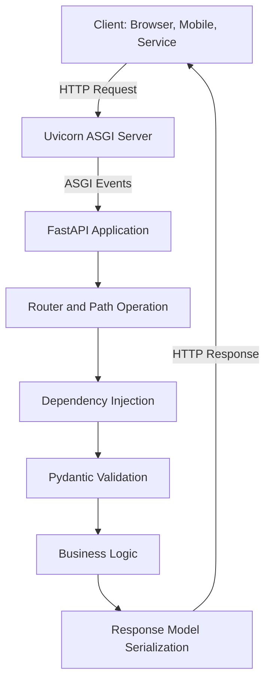
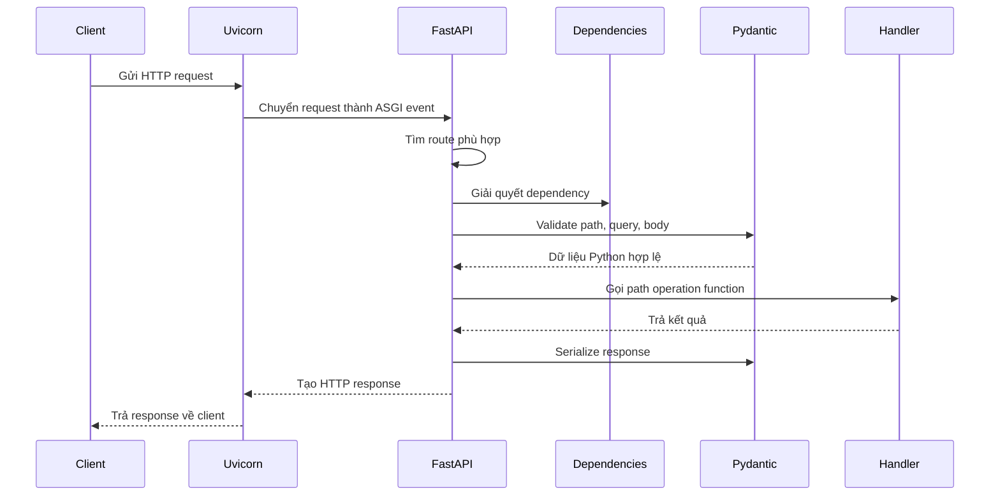
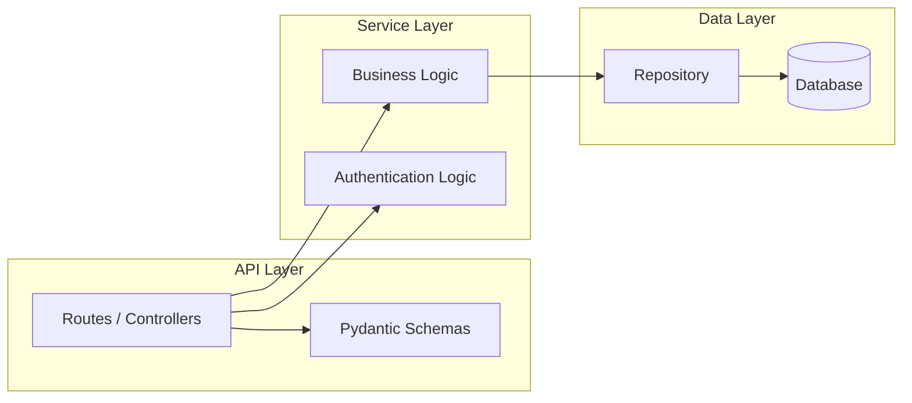
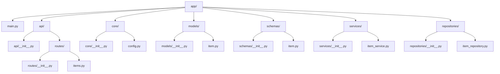

# FastAPI: Cơ sở lý thuyết, kiến trúc và thực hành

## 1. Mục tiêu tài liệu

Tài liệu này trình bày FastAPI theo hướng khoa học và thực hành, giúp người học nắm được:

- FastAPI là gì và vì sao được sử dụng để xây dựng API hiện đại.
- Các thành phần nền tảng của FastAPI như ASGI, Uvicorn, Starlette và Pydantic.
- Cách FastAPI xử lý request, validate dữ liệu và trả về response.
- Cách xây dựng API CRUD đơn giản bằng Python type hints.
- Cách tổ chức cấu trúc project và vận hành ứng dụng FastAPI cơ bản.

## 2. Tổng quan về FastAPI

FastAPI là một web framework hiện đại dùng để xây dựng API bằng Python. Framework này được thiết kế dựa trên Python type hints, giúp code rõ ràng, dễ bảo trì và tự động sinh tài liệu API.

Một ứng dụng FastAPI thường được dùng cho:

- REST API cho web application hoặc mobile application.
- Backend cho hệ thống microservices.
- API cho ứng dụng AI, machine learning và data processing.
- Prototype nhanh các dịch vụ HTTP có validation dữ liệu chặt chẽ.

### 2.1. Đặc điểm nổi bật

| Đặc điểm              | Ý nghĩa                                                          |
| --------------------- | ---------------------------------------------------------------- |
| Hiệu năng cao         | FastAPI chạy trên ASGI và thường được phục vụ bằng Uvicorn.      |
| Type hints            | Sử dụng kiểu dữ liệu Python để validate request và sinh schema.  |
| Tự động sinh tài liệu | Swagger UI tại `/docs` và ReDoc tại `/redoc`.                    |
| Validation mạnh       | Pydantic giúp validate và serialize dữ liệu.                     |
| Dependency Injection  | Quản lý dependency như database session, authentication, config. |
| Hỗ trợ async          | Phù hợp với tác vụ I/O như database, network, file service.      |

## 3. Cơ sở lý thuyết

### 3.1. ASGI

ASGI là viết tắt của **Asynchronous Server Gateway Interface**. Đây là chuẩn giao tiếp giữa web server và ứng dụng Python bất đồng bộ.

Khác với WSGI truyền thống, ASGI hỗ trợ:

- HTTP request/response.
- WebSocket.
- Xử lý bất đồng bộ bằng `async` và `await`.
- Các ứng dụng cần nhiều kết nối đồng thời.

Trong FastAPI, ASGI đóng vai trò là lớp giao tiếp giữa server như Uvicorn và ứng dụng API.

### 3.2. Uvicorn

Uvicorn là ASGI server phổ biến dùng để chạy FastAPI. Khi người dùng gửi request HTTP, Uvicorn nhận request, chuyển đổi thành ASGI event và đưa vào ứng dụng FastAPI.

Lệnh chạy cơ bản:

```bash
uvicorn main:app --reload
```

Trong đó:

- `main` là tên file Python `main.py`.
- `app` là biến FastAPI được khai báo trong file.
- `--reload` tự động khởi động lại server khi code thay đổi, phù hợp khi phát triển.

### 3.3. Starlette

Starlette là toolkit ASGI nhẹ và mạnh, cung cấp các thành phần web nền tảng cho FastAPI, bao gồm:

- Routing.
- Request và response.
- Middleware.
- Exception handling.
- WebSocket.
- Background tasks.

FastAPI xây dựng trên Starlette và bổ sung validation, dependency injection, OpenAPI schema và tích hợp Pydantic.

### 3.4. Pydantic

Pydantic là thư viện dùng để khai báo, validate và serialize dữ liệu dựa trên type hints.

Ví dụ model Pydantic:

```python
from pydantic import BaseModel


class ItemCreate(BaseModel):
    name: str
    price: float
    is_available: bool = True
```

Khi API nhận request body, FastAPI dùng Pydantic để:

- Kiểm tra trường bắt buộc.
- Kiểm tra kiểu dữ liệu.
- Gán giá trị mặc định.
- Sinh JSON schema cho tài liệu OpenAPI.

## 4. Kiến trúc FastAPI

### 4.1. Sơ đồ kiến trúc Mermaid



Kiến trúc trên cho thấy FastAPI không chỉ nhận request và trả response, mà còn thực hiện các bước trung gian như routing, dependency injection, validation và serialization.

## 5. Vòng đời xử lý request và response

### 5.1. Luồng xử lý Mermaid



Quy trình xử lý request có thể tóm tắt như sau:

1. Client gửi request đến server.
2. Uvicorn nhận request và chuyển vào ứng dụng FastAPI theo chuẩn ASGI.
3. FastAPI tìm route phù hợp dựa trên HTTP method và path.
4. Dependency được khởi tạo nếu endpoint yêu cầu.
5. Pydantic validate path parameters, query parameters và request body.
6. Handler thực thi business logic.
7. Kết quả được serialize theo response model.
8. Response được trả về client.

## 6. Các khái niệm cốt lõi

### 6.1. Path parameters

Path parameter là giá trị nằm trực tiếp trong đường dẫn URL.

```python
from fastapi import FastAPI

app = FastAPI()


@app.get("/items/{item_id}")
def get_item(item_id: int):
    return {"item_id": item_id}
```

Với request:

```bash
GET /items/10
```

FastAPI tự động ép `item_id` thành `int`. Nếu client gửi giá trị không hợp lệ, FastAPI trả về lỗi validation.

### 6.2. Query parameters

Query parameter là giá trị nằm sau dấu `?` trong URL.

```python
@app.get("/items")
def list_items(skip: int = 0, limit: int = 10):
    return {"skip": skip, "limit": limit}
```

Ví dụ request:

```bash
GET /items?skip=0&limit=20
```

### 6.3. Request body

Request body thường được dùng trong các method như `POST`, `PUT` hoặc `PATCH`.

```python
from pydantic import BaseModel


class ItemCreate(BaseModel):
    name: str
    description: str | None = None
    price: float
    is_available: bool = True


@app.post("/items")
def create_item(item: ItemCreate):
    return item
```

FastAPI đọc JSON body, validate bằng Pydantic và chuyển thành object Python.

### 6.4. Response model

Response model quy định cấu trúc dữ liệu trả về cho client.

```python
class ItemResponse(BaseModel):
    id: int
    name: str
    price: float
    is_available: bool


@app.get("/items/{item_id}", response_model=ItemResponse)
def get_item(item_id: int):
    return {
        "id": item_id,
        "name": "Notebook",
        "price": 12.5,
        "is_available": True,
        "internal_note": "Không hiển thị trong response",
    }
```

Trường `internal_note` không có trong `ItemResponse`, vì vậy sẽ không xuất hiện trong response JSON.

### 6.5. Dependency Injection

Dependency Injection là cơ chế cho phép endpoint khai báo các thành phần phụ thuộc cần được FastAPI cung cấp.

```python
from fastapi import Depends


def get_current_user():
    return {"username": "student"}


@app.get("/profile")
def read_profile(user: dict = Depends(get_current_user)):
    return {"user": user}
```

Dependency thường được dùng cho:

- Lấy database session.
- Kiểm tra authentication và authorization.
- Đọc config.
- Tái sử dụng logic chung giữa nhiều endpoint.

### 6.6. Middleware

Middleware là lớp xử lý nằm giữa request và endpoint. Nó có thể dùng để logging, thêm header, đo thời gian xử lý hoặc xử lý CORS.

```python
import time
from fastapi import Request


@app.middleware("http")
async def add_process_time_header(request: Request, call_next):
    start_time = time.perf_counter()
    response = await call_next(request)
    process_time = time.perf_counter() - start_time
    response.headers["X-Process-Time"] = str(process_time)
    return response
```

### 6.7. Exception handling

FastAPI cung cấp `HTTPException` để trả về lỗi HTTP có ý nghĩa.

```python
from fastapi import HTTPException


@app.get("/items/{item_id}")
def get_item(item_id: int):
    if item_id <= 0:
        raise HTTPException(status_code=400, detail="item_id phải lớn hơn 0")
    return {"item_id": item_id}
```

### 6.8. Routers

Router giúp chia ứng dụng lớn thành nhiều module nhỏ.

```python
from fastapi import APIRouter

router = APIRouter(prefix="/items", tags=["items"])


@router.get("")
def list_items():
    return []


app.include_router(router)
```

## 7. Ví dụ API CRUD hoàn chỉnh

Ví dụ sau minh họa API quản lý `Item` bằng bộ nhớ tạm thời. Đây không phải database thật, nhưng phù hợp để học routing, validation và response model.

```python
from fastapi import Depends, FastAPI, HTTPException, Query, status
from pydantic import BaseModel, Field

app = FastAPI(
    title="Item API",
    description="API minh họa FastAPI CRUD",
    version="1.0.0",
)


class ItemCreate(BaseModel):
    name: str = Field(min_length=1, max_length=100)
    description: str | None = None
    price: float = Field(gt=0)
    is_available: bool = True


class ItemUpdate(BaseModel):
    name: str | None = Field(default=None, min_length=1, max_length=100)
    description: str | None = None
    price: float | None = Field(default=None, gt=0)
    is_available: bool | None = None


class ItemResponse(BaseModel):
    id: int
    name: str
    description: str | None
    price: float
    is_available: bool


items: dict[int, ItemResponse] = {}
next_id = 1


def get_api_key(api_key: str | None = Query(default=None)):
    if api_key != "demo-key":
        raise HTTPException(
            status_code=status.HTTP_401_UNAUTHORIZED,
            detail="API key không hợp lệ",
        )
    return api_key


@app.get("/health")
def health_check():
    return {"status": "ok"}


@app.post(
    "/items",
    response_model=ItemResponse,
    status_code=status.HTTP_201_CREATED,
)
def create_item(item: ItemCreate, api_key: str = Depends(get_api_key)):
    global next_id

    new_item = ItemResponse(id=next_id, **item.model_dump())
    items[next_id] = new_item
    next_id += 1

    return new_item


@app.get("/items", response_model=list[ItemResponse])
def list_items(skip: int = 0, limit: int = 10):
    return list(items.values())[skip : skip + limit]


@app.get("/items/{item_id}", response_model=ItemResponse)
def get_item(item_id: int):
    item = items.get(item_id)
    if item is None:
        raise HTTPException(status_code=404, detail="Không tìm thấy item")
    return item


@app.patch("/items/{item_id}", response_model=ItemResponse)
def update_item(
    item_id: int,
    item_update: ItemUpdate,
    api_key: str = Depends(get_api_key),
):
    current_item = items.get(item_id)
    if current_item is None:
        raise HTTPException(status_code=404, detail="Không tìm thấy item")

    update_data = item_update.model_dump(exclude_unset=True)
    updated_item = current_item.model_copy(update=update_data)
    items[item_id] = updated_item

    return updated_item


@app.delete("/items/{item_id}", status_code=status.HTTP_204_NO_CONTENT)
def delete_item(item_id: int, api_key: str = Depends(get_api_key)):
    if item_id not in items:
        raise HTTPException(status_code=404, detail="Không tìm thấy item")

    del items[item_id]
    return None
```

### 7.1. Chạy ứng dụng

Cài đặt thư viện:

```bash
pip install fastapi uvicorn
```

Chạy server:

```bash
uvicorn main:app --reload
```

Truy cập tài liệu API tự động:

```text
http://127.0.0.1:8000/docs
http://127.0.0.1:8000/redoc
```

### 7.2. Gọi API mẫu

Tạo item:

```bash
curl -X POST "http://127.0.0.1:8000/items?api_key=demo-key" \
  -H "Content-Type: application/json" \
  -d "{\"name\":\"Notebook\",\"description\":\"A5 notebook\",\"price\":12.5,\"is_available\":true}"
```

Lấy danh sách item:

```bash
curl "http://127.0.0.1:8000/items"
```

Cập nhật item:

```bash
curl -X PATCH "http://127.0.0.1:8000/items/1?api_key=demo-key" \
  -H "Content-Type: application/json" \
  -d "{\"price\":15.0}"
```

Xóa item:

```bash
curl -X DELETE "http://127.0.0.1:8000/items/1?api_key=demo-key"
```

## 8. Sơ đồ phân lớp ứng dụng

### 8.1. Sơ đồ phân lớp Mermaid



Cách chia lớp này giúp ứng dụng dễ mở rộng:

- API Layer tiếp nhận request và trả response.
- Service Layer xử lý nghiệp vụ.
- Data Layer giao tiếp với database hoặc hệ thống lưu trữ.

## 9. Cấu trúc project đề xuất

Một project FastAPI có thể được tổ chức như sau:



Ý nghĩa các thư mục:

| Thành phần     | Vai trò                                  |
| -------------- | ---------------------------------------- |
| `main.py`      | Điểm khởi tạo ứng dụng FastAPI.          |
| `api/routes`   | Khai báo endpoint và router.             |
| `core`         | Cấu hình ứng dụng, security, settings.   |
| `models`       | Model dữ liệu gắn với database.          |
| `schemas`      | Pydantic schema cho request và response. |
| `services`     | Xử lý business logic.                    |
| `repositories` | Truy xuất dữ liệu.                       |

## 10. OpenAPI, Swagger UI và ReDoc

FastAPI tự động sinh OpenAPI schema dựa trên:

- Path operation.
- Type hints.
- Pydantic model.
- Response model.
- Metadata của ứng dụng.

Mặc định, FastAPI cung cấp:

| Đường dẫn       | Chức năng                                                       |
| --------------- | --------------------------------------------------------------- |
| `/docs`         | Swagger UI, cho phép xem và thử API trực tiếp trên trình duyệt. |
| `/redoc`        | ReDoc, hiển thị tài liệu API theo dạng đọc tham khảo.           |
| `/openapi.json` | File OpenAPI schema dạng JSON.                                  |

Ví dụ khai báo metadata:

```python
app = FastAPI(
    title="Student Management API",
    description="API quản lý sinh viên bằng FastAPI",
    version="1.0.0",
)
```

## 11. Ưu điểm và hạn chế

### 11.1. Ưu điểm

- Code ngắn gọn và rõ ràng nhờ type hints.
- Validation tự động, giảm lỗi xử lý dữ liệu thủ công.
- Tài liệu API được sinh từ code, giúp đồng bộ giữa cài đặt và mô tả.
- Hỗ trợ async tốt cho các ứng dụng cần hiệu năng I/O.
- Dễ tách module bằng router và dependency.

### 11.2. Hạn chế

- Cần hiểu type hints và Pydantic để khai thác hiệu quả.
- Ứng dụng lớn cần kiến trúc rõ ràng để tránh logic bị dồn vào endpoint.
- Xử lý database bất đồng bộ, transaction và migration cần thiết kế riêng.
- Một số thư viện Python cũ chỉ hỗ trợ synchronous, cần cân nhắc khi kết hợp với async endpoint.

## 12. Kết luận

FastAPI là framework phù hợp để xây dựng API hiện đại bằng Python. Nền tảng của FastAPI kết hợp ASGI, Starlette và Pydantic, giúp ứng dụng đạt được hiệu năng cao, validation mạnh và tài liệu API tự động.

Về mặt kỹ thuật, FastAPI khuyến khích cách viết code có kiểu dữ liệu rõ ràng, tách biệt request/response schema và tổ chức logic theo các lớp. Khi project phát triển, nên sử dụng router, service layer, repository layer và dependency injection để giữ hệ thống dễ bảo trì.

## 13. Tài liệu tham khảo

- FastAPI Documentation: https://fastapi.tiangolo.com/
- Starlette Documentation: https://www.starlette.io/
- Pydantic Documentation: https://docs.pydantic.dev/
- Uvicorn Documentation: https://www.uvicorn.org/
