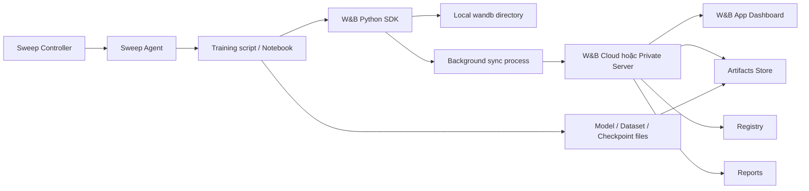
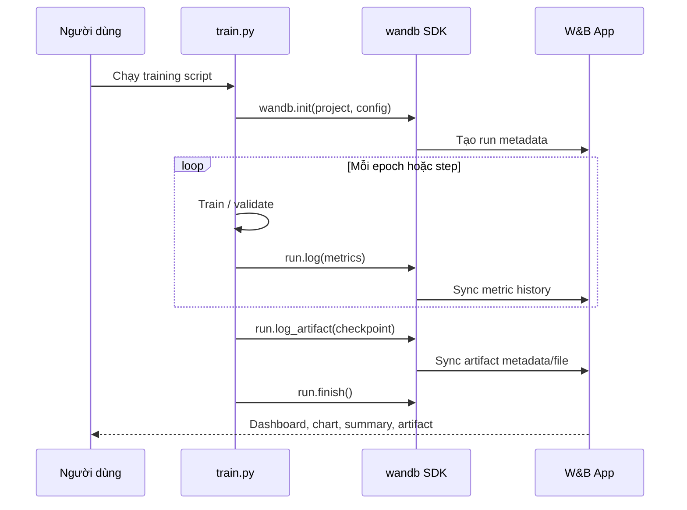
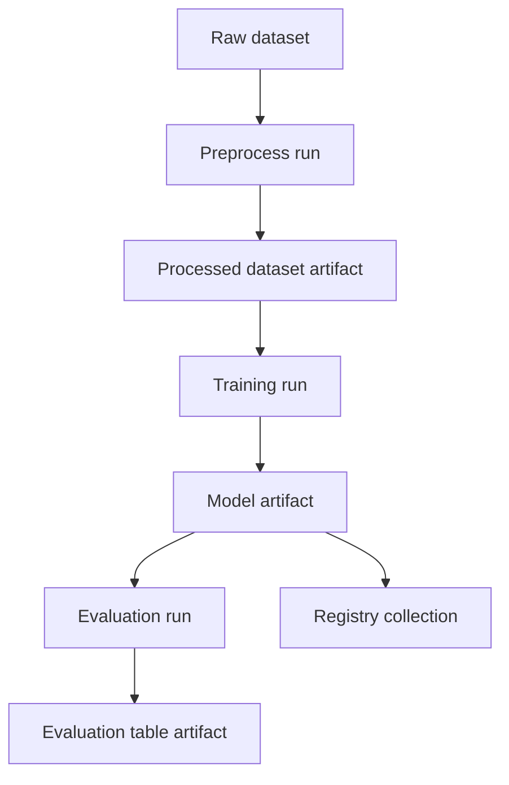
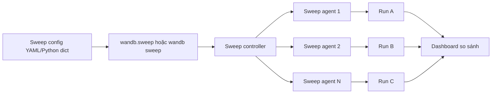
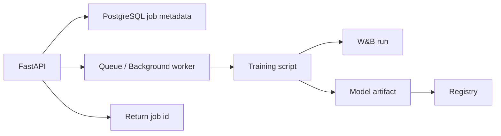

# Weights & Biases (W&B): Cơ sở lý thuyết, kiến trúc và thực hành

## 1. Mục tiêu tài liệu

Tài liệu này trình bày Weights & Biases, thường viết tắt là W&B hoặc `wandb`, theo hướng lý thuyết kết hợp thực hành, giúp người học nắm được:

- W&B là gì và vì sao công cụ này thường được dùng trong machine learning, deep learning, MLOps và ứng dụng LLM.
- Các khái niệm cốt lõi như project, run, config, metric, step, summary, artifact, table, sweep, registry và report.
- Cách cài đặt, đăng nhập và cấu hình W&B bằng Python SDK, CLI và biến môi trường.
- Cách theo dõi thí nghiệm machine learning bằng `wandb.init()`, `run.log()`, `run.config` và dashboard.
- Cách log checkpoint, dataset, model artifact và dùng lại artifact để tái lập pipeline.
- Cách dùng Sweeps để tự động tìm hyperparameter.
- Cách dùng Tables để quan sát prediction, sample lỗi và dữ liệu đánh giá.
- Cách tích hợp W&B với PyTorch, FastAPI, Docker, LangChain, LangGraph, vector database và các thành phần trong repo này.
- Cách thiết kế logging để tránh dashboard chậm, metric rối, lộ secret hoặc khó tái lập thí nghiệm.
- Sự khác nhau giữa W&B Models và W&B Weave.

Tài liệu này tập trung vào W&B Python SDK và W&B Models cho experiment tracking, artifact management và model workflow. Một số API, giao diện W&B App, Registry, Automations hoặc Weave có thể thay đổi theo phiên bản, vì vậy khi làm dự án thực tế nên kiểm tra tài liệu chính thức đúng phiên bản `wandb` đang dùng.

## 2. Tổng quan về Weights & Biases

Weights & Biases là nền tảng giúp theo dõi, trực quan hóa, quản lý và cộng tác trong các dự án machine learning. Khi huấn luyện model, thay vì chỉ in loss ra terminal hoặc lưu vài file CSV thủ công, W&B cho phép log metric, hyperparameter, system metric, model checkpoint, prediction sample, dataset version và báo cáo thí nghiệm vào một dashboard tập trung.

Một workflow học máy thường có nhiều lần thử nghiệm:

```text
Thay đổi dataset -> đổi hyperparameter -> train model -> đánh giá -> lưu checkpoint -> so sánh kết quả
```

Nếu chỉ lưu kết quả bằng file rời rạc, rất dễ gặp các vấn đề:

- Không biết metric nào thuộc commit/code nào.
- Không biết model checkpoint được train bằng dataset nào.
- Không nhớ learning rate, batch size hoặc seed của run tốt nhất.
- Khó so sánh hàng chục hoặc hàng trăm lần train.
- Khó chia sẻ kết quả với người khác.
- Khó tái lập thí nghiệm sau vài tuần.

W&B giải quyết các vấn đề này bằng cách biến mỗi lần chạy thành một **run** có metadata, metric, file, artifact và link dashboard riêng. Các run trong cùng một **project** có thể được so sánh trực quan bằng biểu đồ, bảng, filter, group, tag, report và sweep.

W&B thường được dùng cho:

- Experiment tracking.
- Hyperparameter tuning.
- Model checkpoint tracking.
- Dataset/model versioning.
- So sánh nhiều model.
- Theo dõi GPU, CPU, memory và log terminal.
- Quản lý pipeline training/evaluation.
- Lưu prediction sample để phân tích lỗi.
- Tạo report cho nhóm nghiên cứu hoặc nhóm sản phẩm.
- Quản lý model artifact trong Registry.
- Theo dõi ứng dụng LLM bằng W&B Weave.

### 2.1. Đặc điểm nổi bật

| Đặc điểm | Ý nghĩa |
| --- | --- |
| Experiment tracking | Log metric, config, stdout/stderr, system metric và kết quả huấn luyện theo thời gian. |
| Dashboard trực quan | So sánh loss, accuracy, latency, throughput, GPU utilization hoặc custom metric giữa nhiều run. |
| Config tracking | Lưu hyperparameter, dataset name, model architecture, seed, optimizer và thông tin tái lập. |
| Artifact versioning | Version hóa dataset, checkpoint, model, prediction file hoặc bất kỳ file đầu vào/đầu ra nào. |
| Lineage | Theo dõi artifact nào là input/output của run nào. |
| Sweeps | Tự động chạy hyperparameter search bằng random, grid hoặc Bayesian search. |
| Tables | Lưu dữ liệu dạng bảng, prediction, ảnh, text, audio, video để phân tích lỗi. |
| Registry | Quản lý artifact version cấp tổ chức, ví dụ model đã qua kiểm thử hoặc dataset chuẩn. |
| Reports | Tạo báo cáo có biểu đồ, ghi chú và kết quả để chia sẻ. |
| Integrations | Tích hợp với PyTorch Lightning, Hugging Face, Keras, Docker, cloud platform và nhiều thư viện khác. |
| Offline mode | Có thể log local trước, sync lên W&B sau. |
| Weave | Theo dõi, debug và evaluate ứng dụng LLM/agent/RAG. |

## 3. Cơ sở lý thuyết

### 3.1. Experiment tracking

Experiment tracking là quá trình ghi lại mọi thông tin quan trọng của một thí nghiệm machine learning:

- Code hoặc commit đang chạy.
- Hyperparameter.
- Dataset.
- Model architecture.
- Metric theo từng epoch/batch.
- Kết quả validation/test.
- Checkpoint.
- Prediction sample.
- Environment.
- Log terminal.

Mục tiêu không chỉ là vẽ biểu đồ đẹp. Mục tiêu quan trọng hơn là trả lời được các câu hỏi:

- Run nào tốt nhất?
- Vì sao run đó tốt?
- Model đó được train từ dataset nào?
- Có thể reproduce kết quả đó không?
- Khi deploy model, model artifact đến từ thí nghiệm nào?
- Nếu metric giảm, thay đổi nào đã gây ra?

Trong W&B, experiment tracking xoay quanh `Run`.

### 3.2. Run

Run là một lần thực thi script, notebook, job training, job evaluation hoặc pipeline step. Mỗi run có:

| Thành phần | Ý nghĩa |
| --- | --- |
| `id` | Định danh duy nhất của run trong project. |
| `name` | Tên dễ đọc, có thể đặt thủ công hoặc để W&B sinh tự động. |
| `project` | Project chứa run. |
| `entity` | User hoặc team sở hữu project. |
| `config` | Hyperparameter và biến độc lập của thí nghiệm. |
| `history` | Chuỗi metric được log theo step. |
| `summary` | Giá trị cuối hoặc giá trị tổng hợp quan trọng của run. |
| `tags` | Nhãn để filter, ví dụ `baseline`, `debug`, `production-candidate`. |
| `notes` | Ghi chú ngắn về mục đích của run. |
| `artifacts` | Input/output versioned files liên quan đến run. |
| `files` | File do run tạo và được sync. |

Ví dụ:

```python
import wandb

with wandb.init(
    project="mnist-classifier",
    name="cnn-baseline",
    tags=["baseline", "cnn"],
    notes="Baseline CNN cho MNIST",
    config={
        "epochs": 10,
        "learning_rate": 1e-3,
        "batch_size": 64,
        "architecture": "SmallCNN",
        "optimizer": "Adam",
    },
) as run:
    run.log({"train_loss": 0.42, "val_accuracy": 0.91})
```

Khi dùng `with wandb.init(...) as run`, run sẽ được finish tự động khi block kết thúc hoặc khi exception xảy ra. Trong notebook, nếu tạo run thủ công bằng `run = wandb.init(...)`, nên gọi `run.finish()` khi xong.

### 3.3. Project, entity và team

Project là nơi gom các run có cùng mục tiêu so sánh. Ví dụ:

```text
mnist-classifier
rag-evaluation
recommendation-ranking
bert-finetuning
```

Entity là user hoặc team chứa project. Trong một nhóm làm việc, nên dùng entity là team để mọi người cùng thấy run và artifact.

Quan hệ cơ bản:

```text
Entity/Team
  -> Project
      -> Run
          -> Metrics
          -> Config
          -> Files
          -> Artifacts
```

Một project tốt thường có phạm vi vừa đủ. Không nên để mọi thí nghiệm của nhiều bài toán khác nhau vào một project vì dashboard sẽ khó lọc và metric cardinality tăng nhanh.

### 3.4. Config

Config là nơi lưu biến độc lập của thí nghiệm, thường là những thứ được quyết định trước khi train:

- Learning rate.
- Batch size.
- Epochs.
- Optimizer.
- Scheduler.
- Model architecture.
- Dataset version.
- Seed.
- Loss function.
- Augmentation.
- Embedding model.
- Chunk size trong RAG.
- Retriever top-k.

Ví dụ:

```python
config = {
    "learning_rate": 3e-4,
    "batch_size": 32,
    "epochs": 5,
    "seed": 42,
    "model_name": "resnet18",
    "dataset": "cats-v1",
}

with wandb.init(project="image-classification", config=config) as run:
    lr = run.config["learning_rate"]
    batch_size = run.config["batch_size"]
```

Không nên log loss, accuracy hoặc latency vào config. Các giá trị thay đổi theo thời gian nên log bằng `run.log()`.

### 3.5. Metric, step và summary

Metric là giá trị đo được trong quá trình chạy:

- `train_loss`
- `val_loss`
- `val_accuracy`
- `f1`
- `precision`
- `recall`
- `learning_rate`
- `gpu_memory`
- `retrieval_recall_at_5`
- `answer_faithfulness`
- `latency_ms`

Mỗi lần gọi `run.log()` thường tạo một step mới:

```python
for epoch in range(epochs):
    run.log({
        "epoch": epoch,
        "train_loss": train_loss,
        "val_loss": val_loss,
        "val_accuracy": val_accuracy,
    })
```

`summary` là giá trị đại diện cuối cùng hoặc quan trọng nhất của run. W&B thường tự lấy giá trị cuối của mỗi metric, nhưng ta có thể set thủ công:

```python
run.summary["best_val_accuracy"] = best_val_accuracy
run.summary["best_epoch"] = best_epoch
```

Tên metric nên ổn định, ngắn gọn và dùng ký tự an toàn:

```text
train_loss
val_loss
val_accuracy
learning_rate
```

Tránh tên metric có dấu cách, dấu phẩy, dấu gạch ngang hoặc bắt đầu bằng số:

```text
train loss
loss-train
acc,val
5_fold_score
```

### 3.6. System metrics, console logs và code

Ngoài metric do người dùng log, W&B có thể ghi nhận thêm:

- CPU utilization.
- GPU utilization.
- GPU memory.
- Network.
- Command line.
- Stdout/stderr.
- Git commit.
- Diff nếu có thay đổi chưa commit.
- File dependency hoặc file trong thư mục run.

Điều này rất hữu ích khi debug:

- Loss tăng bất thường vì GPU hết memory?
- Run chậm vì DataLoader nghẽn CPU?
- Run tốt nhất chạy từ commit nào?
- Terminal có warning gì?

Tuy nhiên trong môi trường production hoặc dữ liệu nhạy cảm, cần cấu hình cẩn thận để tránh log thông tin không nên chia sẻ.

### 3.7. Artifact

Artifact là đơn vị version hóa file trong W&B. Artifact thường dùng cho:

- Dataset.
- Model checkpoint.
- Trained model.
- Tokenizer.
- Label mapping.
- Evaluation output.
- Prediction CSV.
- Feature file.
- Embedding file.
- RAG corpus snapshot.

Ví dụ log checkpoint:

```python
import wandb

with wandb.init(project="artifact-demo", job_type="train") as run:
    artifact = wandb.Artifact(name="classifier-checkpoint", type="model")
    artifact.add_file("checkpoints/model.pt")
    run.log_artifact(artifact)
```

Ví dụ dùng lại artifact:

```python
with wandb.init(project="artifact-demo", job_type="evaluate") as run:
    artifact = run.use_artifact("classifier-checkpoint:latest")
    artifact_dir = artifact.download()
    print(artifact_dir)
```

Artifact giúp trả lời câu hỏi:

```text
Model này được sinh ra từ run nào?
Run này dùng dataset version nào?
Evaluation này chạy trên checkpoint nào?
```

### 3.8. Lineage

Lineage là quan hệ input/output giữa run và artifact. Ví dụ:

```text
raw-dataset:v0
  -> preprocessing-run
      -> processed-dataset:v0
          -> training-run
              -> model:v0
                  -> evaluation-run
                      -> evaluation-table:v0
```

Lineage đặc biệt quan trọng trong MLOps vì model không chỉ là file `.pt` hoặc `.pkl`. Một model production cần đi kèm:

- Dataset version.
- Code version.
- Hyperparameter.
- Metric.
- Evaluation report.
- Approval status.
- Owner.

### 3.9. Sweeps

Sweep là cơ chế tự động chạy nhiều run để tìm hyperparameter tốt hơn. Thay vì tự sửa learning rate rồi chạy lại từng lần, ta định nghĩa không gian tìm kiếm:

```yaml
method: random
metric:
  name: val_accuracy
  goal: maximize
parameters:
  learning_rate:
    values: [0.001, 0.0003, 0.0001]
  batch_size:
    values: [32, 64, 128]
  dropout:
    min: 0.1
    max: 0.5
```

Sau đó W&B agent sẽ lấy config, chạy training function và log kết quả. Sweep hỗ trợ các chiến lược phổ biến như random search, grid search và Bayesian optimization.

### 3.10. Table

Table là dữ liệu dạng bảng có thể chứa số, text, ảnh, audio, video, object hoặc prediction. Table rất hữu ích khi muốn hiểu model sai ở đâu.

Ví dụ với bài toán phân loại ảnh:

| id | image | prediction | truth | confidence |
| --- | --- | --- | --- | --- |
| 1 | ảnh | cat | cat | 0.98 |
| 2 | ảnh | dog | cat | 0.71 |

Ví dụ code:

```python
import wandb

with wandb.init(project="table-demo") as run:
    table = wandb.Table(
        columns=["id", "text", "prediction", "truth", "score"],
        data=[
            [1, "PostgreSQL là gì?", "database", "database", 0.94],
            [2, "Docker dùng để làm gì?", "container", "container", 0.91],
        ],
    )
    run.log({"predictions": table})
```

Trong RAG/LLM, Table có thể lưu:

- Question.
- Retrieved documents.
- Generated answer.
- Expected answer.
- Citation.
- Faithfulness score.
- Relevance score.
- Latency.
- Error type.

### 3.11. Registry

Registry là nơi quản lý artifact version cấp tổ chức. Nếu artifact là file/version, Registry là nơi curate các version quan trọng để chia sẻ, kiểm soát quyền và quản lý vòng đời.

Ví dụ:

```text
Registry: Model
  Collection: fraud-detector
    v0: baseline
    v1: better recall
    v2: production candidate
```

Registry phù hợp khi nhóm cần:

- Promote model từ experiment sang staging/production.
- Quản lý dataset chuẩn.
- Gắn tag hoặc alias cho version.
- Theo dõi audit history.
- Kiểm soát quyền truy cập theo tổ chức.
- Kích hoạt downstream process như CI/CD.

### 3.12. Report

Report là tài liệu cộng tác trong W&B App. Report có thể chứa:

- Biểu đồ metric.
- Bảng so sánh run.
- Ghi chú giải thích.
- Hình ảnh, prediction sample, markdown.
- Kết luận thí nghiệm.
- Link run hoặc artifact.

Report giúp biến dashboard thành một câu chuyện có ngữ cảnh:

```text
Chúng ta thử 3 kiến trúc.
Model B có F1 cao nhất nhưng latency cao.
Model C thấp hơn 0.5% F1 nhưng nhanh hơn 40%.
Đề xuất chọn Model C cho staging.
```

### 3.13. W&B Weave

W&B Weave là sản phẩm tập trung vào observability và evaluation cho ứng dụng LLM, agent và RAG. Weave thường dùng để:

- Trace input/output của LLM call.
- Debug agent call và tool call.
- Evaluate response bằng custom scorer hoặc LLM judge.
- So sánh prompt/model.
- Theo dõi ứng dụng LLM sau khi triển khai.

Phân biệt đơn giản:

| Nhu cầu | Công cụ phù hợp |
| --- | --- |
| Theo dõi training model, metric, checkpoint | W&B Models / `wandb` |
| Version dataset, checkpoint, model | W&B Artifacts / Registry |
| Hyperparameter tuning | W&B Sweeps |
| Phân tích prediction sample | W&B Tables |
| Báo cáo kết quả training | W&B Reports |
| Trace LLM app, agent, prompt, RAG call | W&B Weave |

Trong repo này, nếu đang train embedding model hoặc classifier bằng PyTorch thì dùng `wandb`. Nếu đang quan sát chatbot/RAG chạy qua LangChain hoặc LangGraph thì có thể cân nhắc Weave.

## 4. Kiến trúc W&B

### 4.1. Sơ đồ kiến trúc Mermaid



Luồng chính:

1. Script gọi `wandb.init()` để tạo run.
2. SDK tạo thư mục local `wandb/` để lưu metadata tạm thời.
3. Training loop gọi `run.log()` để ghi metric.
4. SDK sync dữ liệu lên W&B Cloud hoặc private server.
5. W&B App hiển thị dashboard, run table, chart, file, artifact và report.
6. Nếu dùng artifact, file đầu vào/đầu ra được version hóa và liên kết với run.

### 4.2. Các thành phần quan trọng

| Thành phần | Vai trò |
| --- | --- |
| Python SDK | API chính để init run, log metric, log artifact, tạo table và tương tác từ code. |
| CLI | Đăng nhập, sync offline run, chạy sweep, cấu hình local. |
| Local run directory | Lưu metadata, log và file tạm trước khi sync. |
| W&B backend | Lưu run metadata, metric history, artifact metadata, project config. |
| Artifact storage | Lưu file artifact hoặc reference đến external storage. |
| W&B App | Giao diện dashboard để xem, so sánh, lọc và chia sẻ run. |
| Sweep controller | Điều phối hyperparameter search. |
| Sweep agent | Worker chạy training function với config do sweep cấp. |
| Registry | Không gian curate artifact version cấp tổ chức. |
| Reports | Không gian viết báo cáo và chia sẻ kết quả. |

### 4.3. W&B Cloud, private server và offline

W&B có thể được dùng theo nhiều kiểu:

| Kiểu dùng | Ý nghĩa |
| --- | --- |
| W&B Cloud | Dùng dịch vụ hosted của W&B, phù hợp để bắt đầu nhanh. |
| Private deployment | Tự triển khai hoặc dùng môi trường riêng cho tổ chức có yêu cầu bảo mật. |
| Offline mode | Log local khi không có mạng hoặc chưa muốn sync. |
| Disabled mode | Tắt W&B hoàn toàn trong một số môi trường chạy tự động. |

Ví dụ offline:

```bash
export WANDB_MODE=offline
python train.py
wandb sync wandb/offline-run-*
```

Trên Windows PowerShell:

```powershell
$env:WANDB_MODE = "offline"
python train.py
wandb sync .\wandb\offline-run-*
```

## 5. Vòng đời thí nghiệm với W&B

### 5.1. Luồng training run



### 5.2. Luồng artifact



Ý tưởng quan trọng: dataset, checkpoint và evaluation output đều là artifact có version. Khi version thay đổi, W&B có thể hiển thị lịch sử và lineage.

### 5.3. Luồng sweep



Sweep agent có thể chạy trên một máy hoặc nhiều máy. Mỗi agent lấy một cấu hình mới, chạy training và log metric mục tiêu để controller quyết định lần thử tiếp theo.

## 6. Các khái niệm cốt lõi

### 6.1. `wandb.login()`

`wandb.login()` dùng để xác thực máy local hoặc notebook với W&B account.

```python
import wandb

wandb.login()
```

Trong môi trường server, CI/CD hoặc Docker, nên dùng biến môi trường:

```bash
export WANDB_API_KEY="your_api_key"
```

Không nên hard-code API key trong code, notebook hoặc file commit lên Git.

### 6.2. `wandb.init()`

`wandb.init()` tạo run mới:

```python
with wandb.init(project="demo", config={"lr": 1e-3}) as run:
    run.log({"loss": 0.5})
```

Các tham số hay dùng:

| Tham số | Ý nghĩa |
| --- | --- |
| `project` | Tên project. |
| `entity` | User/team sở hữu project. |
| `name` | Tên run. |
| `config` | Hyperparameter và metadata tái lập. |
| `tags` | Danh sách tag để filter. |
| `notes` | Ghi chú ngắn. |
| `job_type` | Loại job như `train`, `eval`, `preprocess`. |
| `group` | Gom nhiều run thuộc cùng experiment lớn. |
| `mode` | Có thể dùng `online`, `offline`, `disabled`. |

### 6.3. `run.log()`

`run.log()` ghi metric hoặc object vào run:

```python
run.log({
    "epoch": epoch,
    "train_loss": train_loss,
    "val_loss": val_loss,
    "val_accuracy": val_accuracy,
})
```

Nên log các metric cùng step trong cùng một call để biểu đồ dễ đồng bộ:

```python
run.log({
    "epoch": epoch,
    "train/loss": train_loss,
    "val/loss": val_loss,
    "val/accuracy": val_accuracy,
})
```

Lưu ý: W&B có thể flatten nested dictionary thành tên metric dạng dot-separated. Nếu log quá nhiều key động, dashboard sẽ chậm và khó quản lý.

### 6.4. `run.define_metric()`

Mặc định W&B dùng step làm trục x. Nếu muốn dùng `epoch` làm trục x cho một nhóm metric:

```python
with wandb.init(project="define-metric-demo") as run:
    run.define_metric("epoch")
    run.define_metric("train/*", step_metric="epoch")
    run.define_metric("val/*", step_metric="epoch")

    for epoch in range(10):
        run.log({
            "epoch": epoch,
            "train/loss": 0.5,
            "val/loss": 0.4,
        })
```

Điều này giúp chart đọc tự nhiên hơn khi training loop có batch step nhưng ta muốn so sánh theo epoch.

### 6.5. `run.config`

`run.config` giống dictionary:

```python
with wandb.init(config={"epochs": 10, "lr": 1e-3}) as run:
    epochs = run.config["epochs"]
    lr = run.config.get("lr")
    run.config.update({"optimizer": "AdamW"})
```

Nên cố định config từ đầu run. Việc cập nhật config giữa chừng chỉ nên dùng cho metadata bổ sung, không nên biến config thành nơi lưu metric.

### 6.6. `run.summary`

`run.summary` lưu kết quả đại diện:

```python
best_acc = 0.0

for epoch in range(epochs):
    val_acc = evaluate()
    best_acc = max(best_acc, val_acc)
    run.log({"epoch": epoch, "val_accuracy": val_acc})

run.summary["best_val_accuracy"] = best_acc
```

Summary giúp sort bảng run theo metric quan trọng.

### 6.7. `wandb.Artifact`

Artifact được tạo, thêm file và log:

```python
artifact = wandb.Artifact(
    name="dataset-vietnamese-docs",
    type="dataset",
    metadata={"source": "docs folder", "format": "markdown"},
)
artifact.add_dir("docs")
run.log_artifact(artifact)
```

Các `type` thường gặp:

| Type | Dùng cho |
| --- | --- |
| `dataset` | Dữ liệu train/validation/test. |
| `model` | Checkpoint hoặc model export. |
| `result` | Prediction, metric file, evaluation output. |
| `preprocessed_data` | Dữ liệu đã xử lý. |
| `tokenizer` | Tokenizer hoặc vocab. |

### 6.8. `run.use_artifact()`

Run có thể khai báo artifact là input:

```python
with wandb.init(project="rag", job_type="embed") as run:
    docs_artifact = run.use_artifact("docs-dataset:latest")
    docs_dir = docs_artifact.download()
```

Khi dùng `use_artifact`, lineage sẽ thể hiện run này phụ thuộc vào artifact nào.

### 6.9. `wandb.Table`

Table dùng để log dữ liệu có cấu trúc:

```python
table = wandb.Table(columns=["question", "answer", "score"])
table.add_data("Redis là gì?", "In-memory data store", 0.9)
table.add_data("Milvus là gì?", "Vector database", 0.92)
run.log({"qa_eval": table})
```

Trong bài toán computer vision:

```python
table = wandb.Table(columns=["image", "prediction", "truth"])
table.add_data(wandb.Image("sample.png"), "cat", "dog")
run.log({"mistakes": table})
```

### 6.10. `wandb.Image`, `wandb.Audio`, `wandb.Video`

W&B hỗ trợ log media:

```python
run.log({
    "sample_image": wandb.Image("image.png", caption="prediction=cat"),
})
```

Nên log media có chọn lọc. Không nên log toàn bộ dataset ảnh ở mỗi epoch vì tốn băng thông, storage và làm dashboard chậm.

### 6.11. `wandb.watch()`

Với PyTorch, có thể theo dõi gradient và parameter histogram:

```python
with wandb.init(project="pytorch-watch") as run:
    run.watch(model, log="gradients", log_freq=100)
```

Chỉ nên bật khi cần debug gradient. Với model lớn, log histogram quá thường xuyên có thể làm chậm training.

### 6.12. Public API

W&B Public API dùng để đọc, lọc hoặc cập nhật run/artifact từ Python script ngoài training loop:

```python
import wandb

api = wandb.Api()
run = api.run("entity/project/run_id")
print(run.summary)
print(run.config)
```

Use case:

- Export metric để làm báo cáo riêng.
- Tìm run tốt nhất.
- Cập nhật metadata sau khi run hoàn thành.
- Tự động tạo bảng so sánh.

## 7. Cài đặt và cấu hình

### 7.1. Cài thư viện

```bash
pip install wandb
```

Nếu dùng notebook:

```python
!pip install wandb
```

Kiểm tra version:

```bash
python -c "import wandb; print(wandb.__version__)"
```

### 7.2. Đăng nhập

Cách 1: CLI

```bash
wandb login
```

Cách 2: Python

```python
import wandb

wandb.login()
```

Cách 3: Biến môi trường

```bash
export WANDB_API_KEY="your_api_key"
```

Trên PowerShell:

```powershell
$env:WANDB_API_KEY = "your_api_key"
```

### 7.3. Cấu hình project bằng biến môi trường

Các biến môi trường thường dùng:

| Biến | Ý nghĩa |
| --- | --- |
| `WANDB_API_KEY` | API key để xác thực. |
| `WANDB_ENTITY` | User/team mặc định. |
| `WANDB_PROJECT` | Project mặc định. |
| `WANDB_NAME` | Tên run. |
| `WANDB_NOTES` | Ghi chú run. |
| `WANDB_TAGS` | Tag, phân tách bằng dấu phẩy. |
| `WANDB_MODE` | `online`, `offline` hoặc `disabled`. |
| `WANDB_DIR` | Thư mục lưu file run local. |
| `WANDB_ARTIFACT_DIR` | Thư mục tải artifact. |
| `WANDB_CACHE_DIR` | Thư mục cache. |
| `WANDB_DISABLE_GIT` | Tắt việc đọc Git repo. |
| `WANDB_DISABLE_CODE` | Tắt lưu code/diff ở mức SDK. |
| `WANDB_RESUME` | Điều khiển resume run. |
| `WANDB_RUN_ID` | ID dùng để resume run cụ thể. |

Ví dụ `.env` cho local:

```env
WANDB_ENTITY=my-team
WANDB_PROJECT=sql-nosql-ai-lab
WANDB_MODE=online
```

Không commit `.env` chứa `WANDB_API_KEY`.

### 7.4. Offline và disabled mode

Offline mode:

```python
with wandb.init(project="demo", mode="offline") as run:
    run.log({"loss": 0.1})
```

Disabled mode:

```python
with wandb.init(project="demo", mode="disabled") as run:
    run.log({"loss": 0.1})
```

Hoặc dùng biến môi trường:

```bash
export WANDB_MODE=offline
```

Offline phù hợp khi:

- Máy train không có mạng.
- Không muốn sync dữ liệu trong lúc debug.
- Chạy trong môi trường bảo mật cần kiểm tra log trước khi upload.

Disabled phù hợp khi:

- Unit test không cần log.
- CI đang chạy smoke test.
- Người dùng chưa cấu hình W&B.

### 7.5. Cấu hình bằng file YAML

W&B có thể đọc config từ file `config-defaults.yaml` đặt cạnh script:

```yaml
learning_rate:
  desc: Learning rate for optimizer
  value: 0.001
batch_size:
  desc: Mini-batch size
  value: 64
epochs:
  desc: Number of training epochs
  value: 10
```

Trong code:

```python
with wandb.init(project="yaml-config-demo") as run:
    print(run.config["learning_rate"])
```

Ta cũng có thể override config bằng `wandb.init(config={...})`.

## 8. Ví dụ sử dụng W&B cơ bản

### 8.1. Log metric đơn giản

```python
import random
import wandb

config = {
    "epochs": 10,
    "learning_rate": 0.01,
}

with wandb.init(project="basic-demo", config=config) as run:
    loss = 1.0

    for epoch in range(run.config["epochs"]):
        loss *= 0.8 + random.random() * 0.05
        accuracy = 1.0 - loss

        run.log({
            "epoch": epoch,
            "train_loss": loss,
            "val_accuracy": accuracy,
        })

    run.summary["final_loss"] = loss
```

Sau khi chạy, mở W&B App để xem chart của `train_loss` và `val_accuracy`.

### 8.2. Training loop PyTorch tối giản

```python
import torch
from torch import nn
from torch.utils.data import DataLoader, TensorDataset
import wandb


def make_data():
    x = torch.randn(1000, 10)
    y = (x.sum(dim=1) > 0).long()
    return TensorDataset(x, y)


class Classifier(nn.Module):
    def __init__(self, input_dim=10, hidden_dim=32, num_classes=2):
        super().__init__()
        self.net = nn.Sequential(
            nn.Linear(input_dim, hidden_dim),
            nn.ReLU(),
            nn.Linear(hidden_dim, num_classes),
        )

    def forward(self, x):
        return self.net(x)


config = {
    "epochs": 5,
    "batch_size": 64,
    "learning_rate": 1e-3,
    "hidden_dim": 32,
}

with wandb.init(project="pytorch-basic", config=config) as run:
    dataset = make_data()
    loader = DataLoader(dataset, batch_size=run.config["batch_size"], shuffle=True)

    model = Classifier(hidden_dim=run.config["hidden_dim"])
    optimizer = torch.optim.Adam(model.parameters(), lr=run.config["learning_rate"])
    criterion = nn.CrossEntropyLoss()

    run.watch(model, log="gradients", log_freq=100)

    for epoch in range(run.config["epochs"]):
        model.train()
        total_loss = 0.0
        correct = 0
        total = 0

        for x_batch, y_batch in loader:
            optimizer.zero_grad()
            logits = model(x_batch)
            loss = criterion(logits, y_batch)
            loss.backward()
            optimizer.step()

            total_loss += loss.item() * x_batch.size(0)
            pred = logits.argmax(dim=1)
            correct += (pred == y_batch).sum().item()
            total += x_batch.size(0)

        run.log({
            "epoch": epoch,
            "train_loss": total_loss / total,
            "train_accuracy": correct / total,
        })
```

### 8.3. Log model checkpoint

```python
from pathlib import Path
import torch
import wandb

checkpoint_dir = Path("checkpoints")
checkpoint_dir.mkdir(exist_ok=True)

with wandb.init(project="checkpoint-demo", job_type="train") as run:
    # Sau training
    checkpoint_path = checkpoint_dir / "model.pt"
    torch.save(
        {
            "model_state_dict": model.state_dict(),
            "config": dict(run.config),
        },
        checkpoint_path,
    )

    artifact = wandb.Artifact(
        name="classifier",
        type="model",
        metadata={
            "framework": "pytorch",
            "format": "state_dict",
        },
    )
    artifact.add_file(str(checkpoint_path))
    run.log_artifact(artifact)
```

### 8.4. Dùng lại checkpoint artifact

```python
import torch
import wandb

with wandb.init(project="checkpoint-demo", job_type="evaluate") as run:
    artifact = run.use_artifact("classifier:latest")
    artifact_dir = artifact.download()

    checkpoint = torch.load(f"{artifact_dir}/model.pt", map_location="cpu")
    model.load_state_dict(checkpoint["model_state_dict"])
    model.eval()
```

### 8.5. Log prediction table

```python
import wandb

with wandb.init(project="prediction-table-demo") as run:
    table = wandb.Table(
        columns=["id", "input", "prediction", "label", "correct"]
    )

    samples = [
        (1, "PostgreSQL hỗ trợ SQL", "database", "database"),
        (2, "Redis lưu dữ liệu trên disk là chính", "database", "cache"),
    ]

    for sample_id, text, pred, label in samples:
        table.add_data(sample_id, text, pred, label, pred == label)

    run.log({"predictions": table})
```

### 8.6. Sweep bằng Python SDK

```python
import random
import wandb


def train():
    with wandb.init() as run:
        lr = run.config.learning_rate
        batch_size = run.config.batch_size
        dropout = run.config.dropout

        # Demo metric giả lập
        score = 0.7 + random.random() * 0.2 - dropout * 0.05

        run.log({
            "learning_rate": lr,
            "batch_size": batch_size,
            "dropout": dropout,
            "val_accuracy": score,
        })


sweep_config = {
    "method": "random",
    "metric": {"name": "val_accuracy", "goal": "maximize"},
    "parameters": {
        "learning_rate": {"values": [1e-2, 1e-3, 1e-4]},
        "batch_size": {"values": [32, 64, 128]},
        "dropout": {"min": 0.1, "max": 0.5},
    },
}

sweep_id = wandb.sweep(sweep=sweep_config, project="sweep-demo")
wandb.agent(sweep_id, function=train, count=10)
```

### 8.7. Sweep bằng CLI

Tạo file `sweep.yaml`:

```yaml
method: random
metric:
  name: val_accuracy
  goal: maximize
parameters:
  learning_rate:
    values: [0.001, 0.0003, 0.0001]
  batch_size:
    values: [32, 64, 128]
  hidden_dim:
    values: [64, 128, 256]
program: train.py
```

Khởi tạo sweep:

```bash
wandb sweep --project pytorch-sweep sweep.yaml
```

Chạy agent:

```bash
wandb agent entity/project/sweep_id
```

## 9. W&B trong PyTorch

### 9.1. Những gì nên log

Trong PyTorch training, thường nên log:

| Nhóm | Metric/config |
| --- | --- |
| Config | `learning_rate`, `batch_size`, `epochs`, `optimizer`, `scheduler`, `seed`, `model_name`. |
| Train metric | `train_loss`, `train_accuracy`, `learning_rate`, `grad_norm`. |
| Validation metric | `val_loss`, `val_accuracy`, `f1`, `precision`, `recall`. |
| System | GPU memory, GPU utilization, runtime. |
| Artifact | Best checkpoint, final checkpoint, tokenizer, label mapping. |
| Table | Prediction sample, misclassified sample, confusion cases. |

Không nên log:

- Toàn bộ tensor lớn ở mỗi batch.
- Toàn bộ dataset mỗi epoch.
- Metric có tên sinh động theo sample id, ví dụ `loss_sample_123456`.
- File checkpoint quá thường xuyên nếu không cần.

### 9.2. Best checkpoint

Mẫu phổ biến:

```python
best_val_loss = float("inf")

for epoch in range(epochs):
    train_loss = train_one_epoch()
    val_loss = evaluate()

    run.log({
        "epoch": epoch,
        "train_loss": train_loss,
        "val_loss": val_loss,
    })

    if val_loss < best_val_loss:
        best_val_loss = val_loss
        torch.save(model.state_dict(), "best_model.pt")
        run.summary["best_val_loss"] = best_val_loss
        run.summary["best_epoch"] = epoch

artifact = wandb.Artifact("best-model", type="model")
artifact.add_file("best_model.pt")
run.log_artifact(artifact)
```

### 9.3. Log learning rate

Nếu dùng scheduler:

```python
current_lr = optimizer.param_groups[0]["lr"]
run.log({
    "epoch": epoch,
    "learning_rate": current_lr,
    "train_loss": train_loss,
})
```

Log learning rate giúp hiểu vì sao loss thay đổi tại một giai đoạn.

### 9.4. Confusion matrix đơn giản

```python
import numpy as np
import wandb

class_names = ["negative", "positive"]

run.log({
    "confusion_matrix": wandb.plot.confusion_matrix(
        probs=None,
        y_true=np.array(y_true),
        preds=np.array(y_pred),
        class_names=class_names,
    )
})
```

### 9.5. Log sample lỗi

```python
table = wandb.Table(columns=["text", "prediction", "label", "confidence"])

for item in mistakes[:50]:
    table.add_data(
        item["text"],
        item["prediction"],
        item["label"],
        item["confidence"],
    )

run.log({"mistakes": table})
```

Với computer vision, thay `text` bằng `wandb.Image`.

## 10. W&B trong hệ thống RAG và LLM

### 10.1. Dùng W&B Models cho evaluation

Với hệ thống RAG, W&B Models phù hợp để log các lần đánh giá offline:

- Dataset câu hỏi/đáp án.
- Retriever config.
- Embedding model.
- Chunk size.
- Top-k.
- Reranker.
- Prompt version.
- LLM model.
- Metric như recall@k, MRR, faithfulness, answer correctness, latency.
- Prediction table.

Ví dụ:

```python
with wandb.init(
    project="rag-evaluation",
    config={
        "embedding_model": "text-embedding-model",
        "chunk_size": 800,
        "chunk_overlap": 100,
        "top_k": 5,
        "vector_store": "qdrant",
        "llm": "chat-model",
    },
) as run:
    eval_table = wandb.Table(
        columns=[
            "question",
            "expected_answer",
            "generated_answer",
            "retrieved_sources",
            "faithfulness",
            "latency_ms",
        ]
    )

    for row in eval_rows:
        eval_table.add_data(
            row.question,
            row.expected_answer,
            row.generated_answer,
            row.sources,
            row.faithfulness,
            row.latency_ms,
        )

    run.log({
        "retrieval_recall_at_5": recall_at_5,
        "answer_correctness": answer_correctness,
        "avg_latency_ms": avg_latency_ms,
        "eval_table": eval_table,
    })
```

### 10.2. Dùng Artifact cho RAG corpus

Một RAG pipeline nên version hóa:

- Raw documents.
- Processed chunks.
- Embedding output.
- Evaluation dataset.
- Prompt template.
- Retriever config.

Ví dụ:

```python
artifact = wandb.Artifact(
    name="docs-corpus",
    type="dataset",
    metadata={
        "source": "docs/",
        "chunk_size": 800,
        "chunk_overlap": 100,
    },
)
artifact.add_dir("docs")
run.log_artifact(artifact)
```

Nếu dữ liệu lớn đã nằm ở MinIO/S3, có thể cân nhắc log reference hoặc chỉ log metadata/link thay vì upload lại toàn bộ.

### 10.3. Khi nào dùng Weave

Dùng Weave khi cần quan sát ứng dụng LLM ở cấp request:

- Prompt đầu vào là gì?
- Model trả lời gì?
- Tool nào được agent gọi?
- Retriever trả về context nào?
- User feedback ra sao?
- LLM judge chấm response thế nào?
- Latency từng bước trong chain/graph là bao nhiêu?

Nói ngắn gọn:

```text
W&B Models: đánh giá batch, training, artifact, metric.
Weave: trace runtime của LLM app, agent, prompt và evaluation chi tiết.
```

## 11. W&B trong hệ thống backend

### 11.1. Kiến trúc FastAPI + background training

W&B thường không nên được gọi trực tiếp trong request API latency thấp. Thay vào đó, API tạo job và worker chạy training/evaluation:



FastAPI nên lưu:

- `job_id`
- `user_id`
- `status`
- `wandb_run_url`
- `wandb_project`
- `wandb_run_id`
- `created_at`
- `finished_at`

Worker chịu trách nhiệm:

- Gọi `wandb.init()`.
- Train/evaluate.
- Log metric.
- Log artifact.
- Cập nhật database khi job xong.

### 11.2. Service layer gợi ý

```python
from dataclasses import dataclass
import wandb


@dataclass
class TrainingConfig:
    project: str
    run_name: str
    learning_rate: float
    batch_size: int
    epochs: int


def run_training(config: TrainingConfig) -> str:
    with wandb.init(
        project=config.project,
        name=config.run_name,
        job_type="train",
        config=config.__dict__,
    ) as run:
        for epoch in range(config.epochs):
            metrics = train_one_epoch()
            run.log({"epoch": epoch, **metrics})

        return run.url
```

Trong production, không nên để API key trong code. Nên truyền qua secret manager, environment variable hoặc CI/CD secret.

### 11.3. Docker

Dockerfile hoặc container runtime cần có:

- `wandb` trong dependency.
- `WANDB_API_KEY` truyền qua environment.
- Thư mục writable cho `WANDB_DIR`.
- Network access nếu chạy online.
- Volume nếu chạy offline và muốn sync sau.

Ví dụ Docker Compose:

```yaml
services:
  trainer:
    build: .
    environment:
      WANDB_ENTITY: my-team
      WANDB_PROJECT: sql-nosql-ai-lab
      WANDB_API_KEY: ${WANDB_API_KEY}
    volumes:
      - ./wandb:/app/wandb
    command: python train.py
```

Không hard-code `WANDB_API_KEY` trong `docker-compose.yml` đã commit.

## 12. W&B và các công nghệ trong repo này

Repo này có nhiều thành phần học backend, database, vector database và AI. W&B có thể đóng vai trò quan sát và quản lý thí nghiệm cho các phần liên quan đến model.

| Công nghệ | Cách W&B có thể liên hệ |
| --- | --- |
| PyTorch | Log loss, accuracy, checkpoint, gradient, model artifact. |
| FastAPI | Expose API tạo training/evaluation job và lưu `wandb_run_url`. |
| PostgreSQL | Lưu metadata job, user, trạng thái, link W&B run/artifact. |
| Redis | Queue nhẹ, cache trạng thái job hoặc rate limit API gọi job. |
| Qdrant/Milvus | Log config vector store, embedding model, top-k, evaluation metric cho retrieval. |
| MinIO | Lưu dataset/model lớn; W&B log metadata, reference hoặc artifact tùy kích thước và chính sách. |
| Elasticsearch | Log search config, ranking metric, retrieval comparison. |
| LangChain | Log RAG evaluation batch, prompt version, retriever metric. |
| LangGraph | Log từng experiment của graph workflow hoặc dùng Weave để trace runtime. |
| Docker | Chạy training/evaluation trong container có biến môi trường W&B. |

Ví dụ bài toán RAG trong repo:

```text
docs/*.md
  -> chunking script
  -> embedding model
  -> Qdrant/Milvus
  -> RAG evaluation
  -> W&B run: metrics + prediction table + artifact version
```

Các thông tin nên log:

- `chunk_size`
- `chunk_overlap`
- `embedding_model`
- `vector_db`
- `collection_name`
- `top_k`
- `reranker`
- `llm_model`
- `eval_dataset_version`
- `retrieval_recall_at_k`
- `answer_correctness`
- `avg_latency_ms`

## 13. So sánh W&B với công cụ khác

### 13.1. W&B và TensorBoard

| Tiêu chí | W&B | TensorBoard |
| --- | --- | --- |
| Mục tiêu | Experiment tracking, collaboration, artifacts, sweeps, reports. | Visualization cho training log, đặc biệt phổ biến với TensorFlow/PyTorch. |
| Collaboration | Mạnh, cloud/team dashboard. | Thường local hoặc self-host đơn giản. |
| Artifact versioning | Có. | Không phải trọng tâm chính. |
| Hyperparameter search | Sweeps tích hợp. | Có plugin/hỗ trợ nhưng không phải trọng tâm. |
| Reports | Có. | Không phải trọng tâm. |
| Bắt đầu nhanh | Cần account/API key nếu online. | Dùng local rất nhanh. |

TensorBoard phù hợp khi cần visualization local đơn giản. W&B phù hợp khi cần quản lý thí nghiệm, cộng tác, versioning và workflow MLOps đầy đủ hơn.

### 13.2. W&B và MLflow

| Tiêu chí | W&B | MLflow |
| --- | --- | --- |
| Experiment tracking | Có. | Có. |
| Model registry | Có Registry dựa trên artifact. | Có Model Registry. |
| UI cloud/team | Mạnh nếu dùng W&B Cloud. | Phụ thuộc cách triển khai. |
| Artifact lineage | Mạnh trong W&B Artifacts. | Có artifact tracking, lineage tùy workflow. |
| Hyperparameter sweeps | W&B Sweeps tích hợp. | Thường kết hợp thêm tool khác. |
| Self-host | Có lựa chọn private deployment. | Rất phổ biến trong self-host/open-source workflow. |

MLflow phù hợp khi đội muốn open-source stack và tự quản nhiều. W&B phù hợp khi muốn dashboard đẹp, cộng tác nhanh, sweeps và artifact workflow thuận tiện.

### 13.3. W&B và LangSmith

| Tiêu chí | W&B | LangSmith |
| --- | --- | --- |
| Training ML/DL | Rất phù hợp. | Không phải trọng tâm chính. |
| Artifact/model checkpoint | Có. | Không phải trọng tâm chính. |
| LLM tracing | Có Weave. | Rất mạnh trong hệ sinh thái LangChain/LangGraph. |
| RAG/agent debugging | Weave hoặc W&B Tables tùy nhu cầu. | Mạnh nếu dùng LangChain/LangGraph. |
| Experiment dashboard | Mạnh cho ML metric. | Mạnh cho LLM run trace/eval. |

Nếu dự án chủ yếu là PyTorch training, W&B là lựa chọn tự nhiên. Nếu dự án chủ yếu là LangChain/LangGraph agent, LangSmith hoặc Weave đáng cân nhắc. Hai nhóm công cụ có thể bổ sung nhau.

## 14. Thiết kế project W&B

### 14.1. Đặt tên project

Tên project nên phản ánh bài toán:

```text
rag-docs-eval
pytorch-classifier
embedding-benchmark
recommendation-ranking
```

Tránh tên quá chung:

```text
test
demo
training
my-project
```

### 14.2. Đặt tên run

Tên run nên ngắn nhưng có ý nghĩa:

```python
run_name = "resnet18-lr1e-3-bs64"

with wandb.init(project="image-classification", name=run_name):
    ...
```

Không cần nhét mọi hyperparameter vào name vì config đã lưu đầy đủ. Name chỉ cần giúp đọc bảng run nhanh hơn.

### 14.3. Tags

Tag giúp filter:

```python
tags = ["baseline", "debug", "candidate"]
```

Gợi ý tag:

| Tag | Ý nghĩa |
| --- | --- |
| `baseline` | Run chuẩn để so sánh. |
| `debug` | Run thử nhanh, không dùng làm kết luận. |
| `sweep` | Run thuộc hyperparameter sweep. |
| `candidate` | Model có thể đưa sang staging. |
| `ablation` | Run thử loại bỏ/thay đổi một thành phần. |
| `production` | Run liên quan model production. |

### 14.4. Group và job type

`group` dùng để gom các run liên quan:

```python
with wandb.init(
    project="distributed-training",
    group="experiment-2026-06-11",
    job_type="train",
) as run:
    ...
```

`job_type` mô tả loại bước:

```text
preprocess
train
evaluate
embed
index
rerank
deploy
```

Điều này giúp lineage và dashboard dễ đọc.

### 14.5. Cấu trúc thư mục gợi ý

```text
project/
  train.py
  evaluate.py
  configs/
    baseline.yaml
    sweep.yaml
  checkpoints/
    .gitkeep
  outputs/
    .gitkeep
  wandb/
```

Nên thêm vào `.gitignore`:

```gitignore
wandb/
checkpoints/
outputs/
.env
```

Chỉ commit config mẫu không chứa secret.

## 15. Tối ưu và vận hành

### 15.1. Logging frequency

Không cần log mọi batch nếu training rất dài. Có thể log mỗi `n` batch:

```python
if global_step % 50 == 0:
    run.log({
        "train_loss": loss.item(),
        "global_step": global_step,
    })
```

Gợi ý:

| Tình huống | Cách log |
| --- | --- |
| Dataset nhỏ | Log mỗi epoch hoặc vài batch. |
| Training dài | Log mỗi 50-500 step. |
| Distributed training | Chỉ rank 0 log metric chính. |
| Debug gradient | Bật `run.watch()` tạm thời. |
| Media lớn | Log sample nhỏ, không log toàn bộ. |

### 15.2. Metric cardinality

Metric cardinality là số lượng metric key khác nhau trong project. Nếu tạo key động theo user, sample, layer hoặc timestamp, project sẽ rất khó dùng.

Không nên:

```python
for sample_id, loss in sample_losses.items():
    run.log({f"loss_sample_{sample_id}": loss})
```

Nên:

```python
table = wandb.Table(columns=["sample_id", "loss"])
for sample_id, loss in sample_losses.items():
    table.add_data(sample_id, loss)
run.log({"sample_losses": table})
```

### 15.3. Value size

Không nên log object quá lớn bằng `run.log()`:

```python
run.log({"all_embeddings": huge_embedding_matrix})
```

Nên lưu thành file và log artifact:

```python
np.save("embeddings.npy", embeddings)

artifact = wandb.Artifact("embeddings", type="dataset")
artifact.add_file("embeddings.npy")
run.log_artifact(artifact)
```

### 15.4. Checkpoint strategy

Các cách log checkpoint:

| Chiến lược | Khi nào dùng |
| --- | --- |
| Log final checkpoint | Bài toán đơn giản, chỉ cần model cuối. |
| Log best checkpoint | Cần model tốt nhất theo validation metric. |
| Log every N epochs | Training dài, cần resume hoặc phân tích. |
| Log top-k checkpoints | Cần giữ nhiều candidate. |

Không nên upload checkpoint hàng GB ở mỗi batch.

### 15.5. Distributed training

Trong DDP, thường chỉ process rank 0 log W&B:

```python
is_main_process = rank == 0

if is_main_process:
    run = wandb.init(project="ddp-demo")
else:
    run = None

if is_main_process:
    run.log({"train_loss": loss})
```

Nếu mỗi process tạo một run riêng, cần dùng `group` để gom lại và đặt tên rõ ràng.

### 15.6. Resume run

Resume hữu ích khi job bị ngắt:

```python
with wandb.init(
    project="resume-demo",
    id="unique-run-id",
    resume="allow",
) as run:
    ...
```

Hoặc dùng biến môi trường:

```bash
export WANDB_RUN_ID=unique-run-id
export WANDB_RESUME=allow
```

Cần đảm bảo checkpoint local hoặc artifact có thể khôi phục trạng thái model/optimizer.

## 16. Bảo mật và dữ liệu nhạy cảm

### 16.1. API key

API key là secret. Không đặt API key trong:

- Source code.
- Notebook đã commit.
- Markdown document.
- Dockerfile.
- Public log.
- Screenshot.

Nên đặt trong:

- Environment variable.
- Secret manager.
- CI/CD secret.
- `.env` không commit.

### 16.2. Dữ liệu nhạy cảm

Trước khi log dữ liệu lên W&B, cần kiểm tra:

- Có chứa thông tin cá nhân không?
- Có chứa email, số điện thoại, token hoặc private document không?
- Có log prompt chứa secret không?
- Có log prediction sample từ dữ liệu khách hàng không?
- Project visibility đang là private/team/public?

Nếu dữ liệu nhạy cảm, cân nhắc:

- Ẩn hoặc hash thông tin cá nhân.
- Chỉ log aggregate metric.
- Chỉ log sample đã sanitize.
- Dùng private deployment nếu tổ chức yêu cầu.
- Không bật code/diff logging nếu diff có secret.

### 16.3. Artifact lớn

Không phải file nào cũng nên upload vào W&B. Với file rất lớn, có thể:

- Lưu ở MinIO/S3.
- Log path, URI hoặc metadata.
- Log reference nếu workflow hỗ trợ.
- Chỉ log sample nhỏ.

Thiết kế đúng phụ thuộc vào quy định dữ liệu và chi phí storage.

## 17. Ưu điểm và hạn chế

### 17.1. Ưu điểm

- Dễ tích hợp vào training script bằng vài dòng code.
- Dashboard trực quan, thuận tiện so sánh nhiều run.
- Lưu config, metric, artifact, table và report cùng một nơi.
- Hỗ trợ cộng tác nhóm tốt.
- Sweeps giúp tự động hóa hyperparameter search.
- Artifacts và Registry giúp quản lý version dataset/model rõ ràng.
- Có offline mode cho môi trường không có mạng.
- Tích hợp tốt với PyTorch và hệ sinh thái ML phổ biến.
- Weave mở rộng sang observability cho LLM app.

### 17.2. Hạn chế

- Cần account/API key nếu dùng cloud.
- Nếu log quá nhiều metric/media, dashboard có thể chậm.
- Cần kiểm soát dữ liệu nhạy cảm trước khi upload.
- Artifact lớn có thể tốn storage và thời gian sync.
- Một số tính năng nâng cao phụ thuộc plan, deployment hoặc quyền trong organization.
- Nếu project đặt tên và metric không nhất quán, dashboard dễ rối.
- Với workflow self-host hoàn toàn, MLflow hoặc stack nội bộ có thể phù hợp hơn tùy tổ chức.

## 18. Các lỗi thiết kế thường gặp

### 18.1. Không lưu config đầy đủ

Chỉ log loss và accuracy nhưng không log learning rate, dataset, seed hoặc model name sẽ làm run khó reproduce.

Nên log ít nhất:

```python
config = {
    "learning_rate": lr,
    "batch_size": batch_size,
    "epochs": epochs,
    "seed": seed,
    "model_name": model_name,
    "dataset_version": dataset_version,
}
```

### 18.2. Log metric bằng tên không ổn định

Không nên:

```python
run.log({f"user_{user_id}_loss": loss})
```

Nên dùng Table hoặc artifact.

### 18.3. Log quá thường xuyên

Log mỗi batch trong training cực lớn có thể làm chậm script và dashboard. Nên log theo interval hoặc aggregate.

### 18.4. Dùng config để lưu metric

Không nên:

```python
run.config["val_accuracy"] = val_accuracy
```

Nên:

```python
run.log({"val_accuracy": val_accuracy})
```

### 18.5. Quên finish run trong notebook

Trong notebook:

```python
run = wandb.init(project="demo")
run.log({"loss": 0.1})
run.finish()
```

Nếu quên finish, các cell sau có thể log nhầm vào run cũ.

### 18.6. Upload checkpoint quá nhiều

Log checkpoint mỗi batch thường không cần thiết. Nên log best/final checkpoint hoặc mỗi vài epoch.

### 18.7. Log secret vào config hoặc notes

Không đưa API key, database password, private URL hoặc token vào `config`, `notes`, table hoặc artifact metadata.

### 18.8. Không dùng artifact cho dataset/model

Nếu chỉ lưu checkpoint local, sau vài ngày khó biết checkpoint nào tương ứng run nào. Nên log checkpoint quan trọng bằng artifact.

### 18.9. Không phân biệt debug run và experiment thật

Debug run nên có tag `debug` hoặc project riêng:

```python
tags=["debug"]
```

Nếu không, bảng run sẽ lẫn nhiều kết quả thử tạm.

### 18.10. Project quá rộng

Không nên gom mọi thứ vào một project `experiments`. Nên tách theo bài toán hoặc sản phẩm.

### 18.11. Không kiểm soát quyền project

Trước khi log dữ liệu thật, kiểm tra visibility của project và team permission.

### 18.12. Dùng W&B trong request đồng bộ

Không nên để endpoint FastAPI chờ training và log trực tiếp trong request dài. Nên tách thành background worker/job.

## 19. Bài tập thực hành

### Bài 1: Cài và đăng nhập W&B

Cài thư viện:

```bash
pip install wandb
```

Đăng nhập:

```bash
wandb login
```

Chạy script tạo một run có metric `loss` giảm qua 10 epoch.

### Bài 2: Log config

Viết script có config:

- `learning_rate`
- `batch_size`
- `epochs`
- `optimizer`
- `seed`

Log `train_loss` và `val_accuracy` theo epoch.

### Bài 3: PyTorch training

Tạo dataset synthetic bằng PyTorch, train một model `nn.Linear` hoặc MLP nhỏ. Log:

- `train_loss`
- `train_accuracy`
- `epoch`
- `learning_rate`

### Bài 4: Log artifact checkpoint

Sau khi train, lưu `model.state_dict()` vào `model.pt` và log thành artifact type `model`.

Sau đó viết script evaluation dùng `run.use_artifact("model-name:latest")` để tải checkpoint.

### Bài 5: Prediction table

Tạo bảng gồm:

- `input`
- `prediction`
- `label`
- `correct`
- `confidence`

Log ít nhất 20 dòng prediction.

### Bài 6: Sweep

Tạo sweep tìm:

- `learning_rate`: `[0.01, 0.001, 0.0001]`
- `batch_size`: `[32, 64]`
- `hidden_dim`: `[32, 64, 128]`

Mục tiêu maximize `val_accuracy`.

### Bài 7: RAG evaluation table

Dựa trên các file trong `docs`, thiết kế evaluation table cho RAG gồm:

- `question`
- `expected_answer`
- `generated_answer`
- `source_files`
- `retrieval_score`
- `answer_score`
- `latency_ms`

Giải thích metric nào nên log bằng `run.log()`, dữ liệu nào nên log bằng `wandb.Table`, dữ liệu nào nên log bằng artifact.

### Bài 8: Offline mode

Chạy một script với:

```bash
WANDB_MODE=offline
```

Sau đó dùng:

```bash
wandb sync
```

để sync run lên W&B.

## 20. Lộ trình học đề xuất

1. Hiểu khái niệm run, project, config và metric.
2. Cài `wandb`, đăng nhập và log metric đơn giản.
3. Tích hợp `wandb.init()` và `run.log()` vào training loop PyTorch.
4. Học cách đặt tên metric, run, project, tag và notes.
5. Log best checkpoint bằng artifact.
6. Dùng `run.use_artifact()` để evaluate checkpoint đã log.
7. Dùng Tables để phân tích prediction và lỗi.
8. Tạo sweep để tìm hyperparameter.
9. Thiết kế project W&B cho một bài toán RAG hoặc classifier.
10. Học cách dùng offline mode, resume và biến môi trường.
11. Tìm hiểu Registry để quản lý model/dataset version quan trọng.
12. Tạo Report để trình bày kết quả cho người khác.
13. Nếu làm LLM app, học thêm W&B Weave hoặc công cụ tracing tương đương.

## 21. Kết luận

Weights & Biases là công cụ rất hữu ích để đưa quá trình thử nghiệm machine learning ra khỏi kiểu quản lý thủ công bằng terminal, file CSV và checkpoint rời rạc. Với vài dòng code, W&B giúp log metric, config, system metric, artifact, table và report vào một dashboard tập trung, nhờ đó việc so sánh, tái lập và chia sẻ kết quả trở nên rõ ràng hơn.

Về mặt kỹ thuật, W&B xoay quanh các khái niệm project, run, config, metric, summary, artifact, table, sweep, registry và report. Khi dùng đúng, mỗi model checkpoint không còn là một file lẻ không rõ nguồn gốc, mà trở thành một artifact có lineage, biết được nó được train từ dataset nào, bằng config nào và đạt metric gì.

Trong repo này, W&B đặc biệt phù hợp với các phần liên quan đến PyTorch, RAG evaluation, vector database benchmarking, LangChain/LangGraph workflow evaluation và các job training/evaluation chạy bằng Docker hoặc FastAPI worker. PostgreSQL có thể lưu metadata nghiệp vụ và link đến W&B run, MinIO có thể lưu file lớn, còn W&B lưu metric, artifact metadata, bảng phân tích và report.

Khi dùng W&B trong dự án thật, cần chú ý thiết kế logging ngay từ đầu: đặt tên metric ổn định, log config đầy đủ, dùng artifact cho dataset/model, dùng table cho prediction sample, hạn chế log dữ liệu quá lớn và bảo vệ secret. Công cụ tốt không thay thế tư duy thí nghiệm tốt, nhưng W&B giúp tư duy đó được ghi lại, so sánh và truyền đạt một cách có hệ thống.

## 22. Tài liệu tham khảo

- W&B Documentation: https://docs.wandb.ai/
- W&B Quickstart: https://docs.wandb.ai/models/quickstart
- W&B Experiments overview: https://docs.wandb.ai/models/track
- Create an experiment: https://docs.wandb.ai/models/track/create-an-experiment
- Configure experiments: https://docs.wandb.ai/models/track/config
- Log objects and media: https://docs.wandb.ai/models/track/log
- Log tables: https://docs.wandb.ai/models/track/log/log-tables
- W&B Tables overview: https://docs.wandb.ai/models/tables
- W&B Artifacts overview: https://docs.wandb.ai/models/artifacts
- W&B Sweeps overview: https://docs.wandb.ai/models/sweeps
- W&B Registry overview: https://docs.wandb.ai/models/registry
- W&B Reports overview: https://docs.wandb.ai/models/reports
- W&B Environment variables: https://docs.wandb.ai/models/track/environment-variables
- W&B Logging at scale and performance: https://docs.wandb.ai/models/track/limits
- W&B Integrations overview: https://docs.wandb.ai/models/integrations
- W&B Python SDK Reference: https://docs.wandb.ai/ref/python/
- W&B CLI Reference: https://docs.wandb.ai/ref/cli/
- W&B Public API Reference: https://docs.wandb.ai/ref/python/public-api/
- W&B Weave Documentation: https://docs.wandb.ai/weave
